Augmentation pipeline for rendering synthetic paper printing and scanning processes.

# Overview

Training neural networks to work with images requires us to augment them in a variety of ways so that they learn to generalize. Networks designed to work with scanned document images must be trained with images that have the type of distortions seen in the wild.

Augraphy is an augmentation library developed to emulate these effects in a pipeline designed to emulate the real world process of printing and scanning a document.

# How It Works

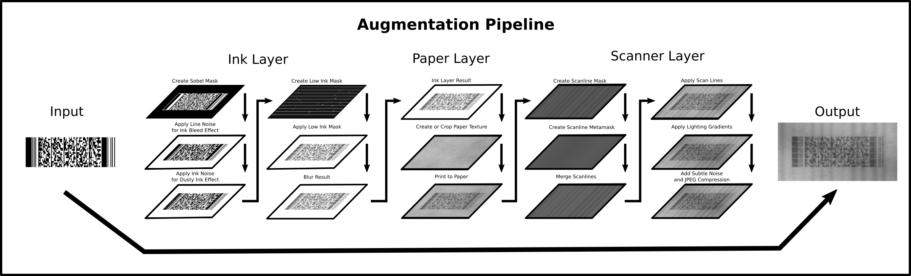

Augraphy's augmentation pipeline starts with augmentations that emulate effects like Ink Bleed, Dusty Ink and Low Ink. Augraphy then virtually prints it to paper that has been generated mathematically or cropped from paper texture images. This image is then augmented further with distortions that can be created by scanners.

The end result is an image that mimics real scanned document images.

**Example**


# Installation

Use the package manager [pip](https://pip.pypa.io/en/stable/) to install augraphy.

```bash
pip install augraphy
```

# Usage

## Import the Package
```python
from Augraphy import AugraphyPipeline
from Augraphy.Augmentations import *
```

## Create Default Pipeline

```python
from Augraphy import default_augraphy_pipeline

pipeline = default_augraphy_pipeline()
```

## Optional: Modify Default Pipeline

## Optional: Build Augmentation Pipeline Phases
```python
ink_phase = AugmentationSequence([
    InkBleedAugmentation(),
    DustyInkAugmentation(),
    LowInkBlobsAugmentation(), 
    OneOf([
        LowInkRandomLinesAugmentation(use_consistent_lines=False),
        LowInkRandomLinesAugmentation(use_consistent_lines=True), 
        LowInkPeriodicLinesAugmentation(use_consistent_lines=False), 
        LowInkPeriodicLinesAugmentation(use_consistent_lines=True), 
    ]),
    GaussianBlurAugmentation('ink', probability=1)
])

paper_phase = AugmentationSequence([
    PaperFactory(),
    OneOf([
    AugmentationSequence([
        NoiseTexturizeAugmentation(probability=1.0),
        BrightnessTexturizeAugmentation(),
        GaussianBlurAugmentation('paper', [(3,3), (3,5), (5,3), (5,5)]),
        ]),
    AugmentationSequence([
        BrightnessTexturizeAugmentation(probability=1.0),
        NoiseTexturizeAugmentation(),
        GaussianBlurAugmentation('paper', [(3,3), (3,5), (5,3), (5,5)]),
    ])]),
    BrightnessAugmentation('paper')
])


post_phase = AugmentationSequence([
    OneOf([
            LightingGradientAugmentation(),
            BrightnessAugmentation('post')
    ]),
    SubtleNoiseAugmentation(),
    JpegAugmentation()
])
```

## Load and Augment Image
```python
img = cv2.imread("image.png")
data = pipeline.augment(img)
```

## Data Dictionary Output

TODO: Tabelize

The output of the pipeline will be a dictionary containing the image at various stages of processing along with augmentations applied. Additional metadata can be added by augmentations in the pipeline.

```data['image']``` stores the initial input image before any modifications were made.

```data['image_rotated']``` stores the initial input image after rotation. This will serve as the *Ground Truth* for training neural networks.

```data['ink']``` contains a list of ```AugmentationResult```s with the augmentation and resulting image for each step of the ink phase.

```data['paper_texture']``` contains the image selected to be used as the paper texture by ```PaperFactory```.

```data['paper']``` contains a list of ```AugmentationResult```s with the augmentation and resulting image for each step of the paper phase.

```data['post']``` contains a list of ```AugmentationResult```s with the augmentation and resulting image for each step of the post phase.

```data['output']``` stores the final image after all augmentations are applied.

# Augmentations

## Base Augmentations

### Augmentation Sequence

Augmentation Sequenece creates a sequence of augmentations that will be executed in order.

**Usage:**

```python
augmentation = AugmentationSequence(
        augmentations=[
            # Add Augmentations Here
        ]
        probability=1.0
    )
```

```augmentations``` specifies the list of augmentations to be ran.

```probability``` specifies the probability that the augmentation sequence will run.

### One Of

Augmentation list that will execute one of the specified augmentations randomly. Probabilities for the specified augmentations will be used as weights for which one will be selected and the probability at the OneOf level will be used to determine if any are selected.

**Usage:**

```python
augmentation = OneOf(
        augmentations=[
            # Add Augmentations Here
        ]
        probability=0.5
    )
```

```augmentations``` specifies the list of augmentations to be chosen from.

```probability``` specifies the probability that the augmentation sequence will run.

### Gaussian Blur

The Gaussian Blur augmentations applies a gaussian blur to the whole image.

**Usage:**

```python
augmentation = GaussianBlurAugmentation(
        kernels=[(3,3)], 
        sigmaX=0,
        probability=0.5
    )
```

```kernels``` specifies a list of blur kernels, one of which will be selected randomly when the blur is applied.

```sigmaX``` specifes sigmaX value of the gaussian blur.

```probability``` specifies the probability that the augmentation will run.

### Brightness

The Brightness augmentation adjusts the brightness of the whole image by a chosen multiplier.

**Usage:**

```python
augmentation = BrightnessAugmentation(
        range=(0.8, 1.4)
        probability=0.5
    )
```

```range``` specifies the range of values to be chosen at random for the brightness multiplier applied.

```probability``` specifies the probability that the augmentation will run.


## Ink Processing Phase

### **Ink Bleed**

The Ink Bleed augmentation relies on sobel edge detection to create a mask of all edges, then applies random noise to those edges. When followed by a blur this creates a fuzzy edge that emulates an ink bleed effect.

**Usage:**

```python
augmentation = InkBleedAugmentation(
        intensity_range=(.1, .2), 
        color_range=(0, 224)
        probability=0.5
    )
```

```intensity_range``` range of intensities to select from. Intensity must be a value between 0 to 1 and specifies the intensity of the noise added to the edges.

```color_range``` specifes the value range of the colors used for noise.

```probability``` specifies the probability that the augmentation will run.

**Example:**

Before and After Blur


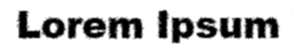

### **Dusty Ink**

The Dusty Ink augmentation applies random noise to the ink itself, emulating a dusty or inconsistent ink tone when followed by a blur.

**Usage:**

```python
augmentation = DustyInkAugmentation(
        intensity_range=(.1, .2), 
        color_range=(0, 224)
        probability=0.5
    )
```

```intensity_range``` range of intensities to select from. Intensity must be a value between 0 to 1 and specifies the intensity of the noise added to the edges.

```color_range``` specifes the value range of the colors used for noise.

```probability``` specifies the probability that the augmentation will run.

**Example:**

Before and After Blur


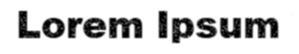

### **Low Ink Blobs**

The Low Ink Blobs augmentation uses ```sklearn.datasets.make_blobs``` to create random blobs of "low ink" that will be applied to the image.

**Usage:**

```python
augmentation = LowInkBlobsAugmentation(
        count_range=(5, 25), 
        size_range=(10, 20), 
        points_range=(5, 25), 
        std_range=(10, 75), 
        features_range=(15, 25), 
        value_range=(180, 250),
        probability=0.5
    )
```

```count_range``` specifies the range for the number of blobs to add to the imaqge.

```size_range``` specifies the range in pixels for the size of the image patch that blobs will be created in.

```points_range``` specifies the number of points to add to image patch to create the blob.

```std_range``` specifies the std_range value passed into ```sklearn.datasets.make_blobs```

```features_range``` specifies the features_range value passed into ```sklearn.datasets.make_blobs```

```values_range``` specifies the range of values used for the blob pixels.

```probability``` specifies the probability that the augmentation will run.

**Example:**


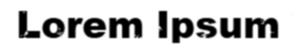

### **Low Ink Lines**

```LowInkLinesRandomAugmentation``` and ```LowInkLinesPeriodicAugmentation``` inherit from ```LowInkLineAugmentation```. LowInkLinesRandomAugmentation adds low ink lines randomly throughout the image while LowInkLinesPeriodicAugmentation creates a set of lines that repeat in a periodic fashion throughout the image.

**Usage:**

```python
augmentation = LowInkRandomLinesAugmentation(
        count_range=(5, 10), 
        use_consistent_lines=True,
        probability=0.5
    )
```

```count_range``` specifies the number of lines to add to the image.

```probability``` specifies the probability that the augmentation will run.

```python
augmentation = LowInkPeriodicLinesAugmentation(
        count_range=(5, 10),
        period_range=(10, 30),
        use_consistent_lines=True,
        probability=0.5
    )
```

```count_range``` specifies the number of lines to add that will be repeated.

```period_range``` specifies the number of pixels in each period before lines are repeated.

```probability``` specifies the probability that the augmentation will run.

**Example:**

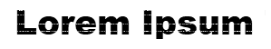
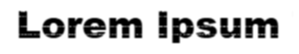

## Paper Processing Phase

The Augmentations specified in the paper phase will be applied to the background paper image returned by the paper factory before the ink is printed to it. A solid grayscale color between 255 and 196 image can also be used as a source and will be texturized by the default augmentations documented here.

**Initial Image used for Examples:**


(Blank Paper Page)

### Paper Factory

Randomly replaces the starting paper image with a texture chosen from a directory and resized to fit or cropped and tiled to fit.

**Usage:**

```python
augmentation = PaperFactory(
        tile_texture_shape=(250,250), 
        texture_path="./paper_textures"
        probability=0.5
    )
```

```tile_texture_shape``` specifies the size of the texture crop when tiling a texture.

```paper_texture_path``` defines where the images used for non-generated paper textures will be loaded from. See the ```paper_textures``` folder on Github for examples.

```probability``` specifies the probability that the augmentation will run.

### **Noise Texturize**

The Noise Texturize augmentation creates a random noise based texture pattern to emulate paper textures.

**Usage:**

```python
augmentation = NoiseTexturizeAugmentation(
        sigma_range=(3, 10), 
        turbulence_range=(2, 5)
        probability=0.5
    )
```

```sigma_range``` specifies the bounds of noise fluctuations.

```turbulence_range``` specifies the  how quickly big patterns will be replaced with the small ones. The lower the value the more iterations will be performed during texture generation..

```probability``` specifies the probability that the augmentation will run.

**Example:**

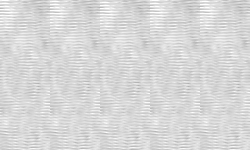

### **Brightness Texturize**

The Noise Texturize augmentation creates a random noise in the brightness channel to emulate paper textures.

**Usage:**

```python
augmentation = BrightnessTexturizeAugmentation(
        range=(0.9, 0.99), 
        deviation=0.03
        probability=0.5
    )
```

```range``` specifies the range of the brightness noise.

```deviation``` specifies the deviation in the brightness noise.

```probability``` specifies the probability that the augmentation will run.

**Example:**

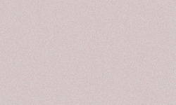

### **Texturize Augmentations Blur**

When generating or augmenting paper textures, the final blur step results in realistic looking paper textures.

**Usage:**

```python
augmentation = AugmentationSequence([
        NoiseTexturizeAugmentation(),
        BrightnessTexturizeAugmentation()
        GaussianBlurAugmentation([(3,3), (3,5), (5,3), (5,5)])
    ])
```

**Example:**

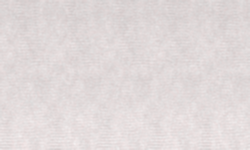

## Post Processing Phase

### **Dirty Rollers**

The Dirty Rollers augmentation emulates an effect created by certain document scanners.

**Usage:**

```python
augmentation = DirtyRollersAugmentation(
        line_width_range=(8, 12)
        probability=0.5
    )
```

```line_width_range``` specifies the base width of the rollers/bars/lines of the brightness gradients.

```probability``` specifies the probability that the augmentation will run.

**Example:**


### **Lighting Gradient**

The Lighting Gradient augmentation generates a decayed light mask generated by a light strip given its position and direction and applies it to the image as a lighting or brightness gradient.

**Usage:**

```python
augmentation = LightingGradientAugmentation(
        light_position=None, 
        direction=None, 
        max_brightness=255, 
        min_brightness=0, 
        mode="gaussian", 
        linear_decay_rate=None, 
        transparency=None
        probability=0.5
    )
```
      position: tuple of integers (x, y) defining
      direction: integer from 0 to 360 to indicate the rotation degree of light strip
      max_brightness: integer that max brightness in the mask
      min_brightness: integer that min brightness in the mask
      mode: the way that brightness decay from max to min: linear or gaussian
      linear_decay_rate: only valid in linear_static mode. Suggested value is within [0.2, 2]

```light_position``` tuple of integers (x, y) specifying the center of light strip position, which is the reference point during rotating.

```direction``` integer from 0 to 360 specifying the rotation degree of light strip.

```max_brightness``` specifies the max brightness in the mask.

```min_brightness``` specifies the min brightness in the mask.

```mode``` specifies the way that brightness decay from max to min: linear or gaussian.

```linear_decay_rate``` only valid in linear_static mode. Suggested value is within [0.2, 2]

```transparency``` specifies the transparency used by the generated mask, value range of 0 to 1.

```probability``` specifies the probability that the augmentation will run.

**Example:**

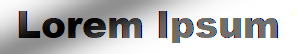

### **Subtle Noise**

The Subtle Noise augmentation emulates the imperfections in scanning solid colors due to subtle lighting differences.

**Usage:**

```python
augmentation = SubtleNoiseAugmentation(
        range=5,
        probability=0.5
    )
```

```range``` specifies the range added or subtracted from each pixel value in the image. With a range of 5, a pixel with color value of 100 will end up between 95 and 105. 

```probability``` specifies the probability that the augmentation will run.

**Example:**

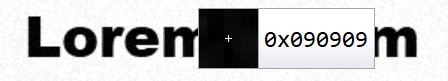

### **JPEG Compression**

The JPEG augmentation uses JPEG encoding to create JPEG compression artifacts in the image.

**Usage:**

```python
augmentation = JpegAugmentation(
        quality_range=(50, 95),
        probability=0.5
    )
```

```quality_range``` specifies the quality range for the JPEG compression encoding.

```probability``` specifies the probability that the augmentation will run.

**Example:**

Encoded with quality range of (10, 15)

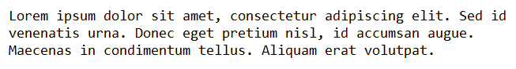
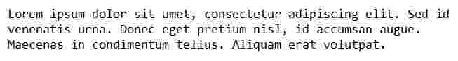

# Roadmap

- [X] Ink effects (Bleed/Dusty/Low)
- [X] Paper textures (Generated/Images)
- [X] Scanner effects (Scanlines/Brightness Gradients)
- [X] Improved Configuration capabilities
- [X] Improve Modularity to allow new augmentations to easily be added.
- [ ] Convert DirtyRollers to use HSV for Brightness adjustment.

# Contributing
Pull requests are welcome. For major changes, please open an issue first to discuss what you would like to change.

# License
**MIT**

Copyright 2021 Sparkfish LLC

Permission is hereby granted, free of charge, to any person obtaining a copy of this software and associated documentation files (the "Software"), to deal in the Software without restriction, including without limitation the rights to use, copy, modify, merge, publish, distribute, sublicense, and/or sell copies of the Software, and to permit persons to whom the Software is furnished to do so, subject to the following conditions:

The above copyright notice and this permission notice shall be included in all copies or substantial portions of the Software.

THE SOFTWARE IS PROVIDED "AS IS", WITHOUT WARRANTY OF ANY KIND, EXPRESS OR IMPLIED, INCLUDING BUT NOT LIMITED TO THE WARRANTIES OF MERCHANTABILITY, FITNESS FOR A PARTICULAR PURPOSE AND NONINFRINGEMENT. IN NO EVENT SHALL THE AUTHORS OR COPYRIGHT HOLDERS BE LIABLE FOR ANY CLAIM, DAMAGES OR OTHER LIABILITY, WHETHER IN AN ACTION OF CONTRACT, TORT OR OTHERWISE, ARISING FROM, OUT OF OR IN CONNECTION WITH THE SOFTWARE OR THE USE OR OTHER DEALINGS IN THE SOFTWARE.