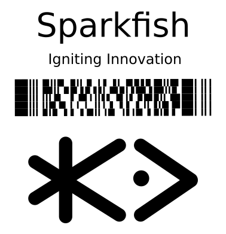
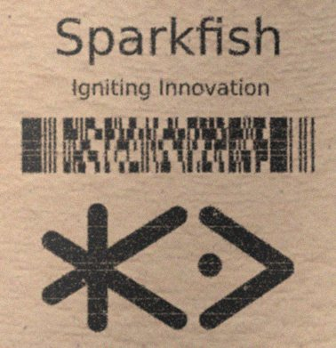

<p align="center">
    
</p>

Augraphy is a Python library that creates multiple copies of original documents though an augmentation pipeline that randomly distorts each copy -- degrading the clean version into dirty and realistic copies rendered through synthetic paper printing, faxing, scanning and copy machine processes.

Highly-configurable pipelines apply adjustments to the originals to create realistic old or noisy documents by acting as a factory, producing almost an infinite number of variations from their source.  This simulation of realistic paper-oriented process distortions can create large amounts of training data for AI/ML processes to learn how to remove those distortions.

Treatments applied by Augraphy fabricate realistic documents that appear to have been printed on dirty laser or inkjet printers, scanned by dirty office scanners, faxed by low-resolution fax machines and otherwise mistreated by real-world paper handling office equipment.

# What makes Augraphy Magical?
Virtually no readily available datasets exist with both a _clean_ and _noisy_ version of target documents.  Augraphy addresses that problem by manufacturing large volumes of high-quality noisy documents to train alongside their clean source originals.

Training neural networks typically requires augmenting limited sources of data in a variety of ways so that networks can learn to generalize their solutions.  Networks designed to work with scanned document images must be trained with images that have the type of distortions and noise typical of real-world scanned office documents.

However, if we only have real-world dirty documents, then we don’t have a good way to know for sure what the right answer is when training a neural network.  By going in the reverse direction, starting with the clean document we hope a trained network will produce, we can simulate training data with dirty documents for which we already have a perfect original.

With flawless rendering of distorted "originals", we can train a model to undo all that distortion and restore the document to its original form.  It’s pretty much magic!

# How It Works
Augraphy's augmentation pipeline starts with an image of a clean document.  The pipeline begins by extracting the text and graphics from the source into an "ink" layer.  (Ink is synonymous with toner within Augraphy.)  The augmentation pipeline then distorts and degrades the ink layer.

A paper factory provides either a white page or a randomly-selected paper texture base.  Like the ink layer, the paper can also be processed through a pipeline to further provide random realistic paper textures.

After both the ink and paper phases are completed, processing continues by applying the ink, with its desired effects, to the paper.  This merged document image is then augmented further with distortions such as adding folds or other physical deformations or distortions that rely on simultaneous interactions of paper and ink layers.

The end result is an image that mimics real documents.

<p align="center" width="100%">
     
</p>

## Example Before / After Images
<p align="center" width="100%">
     
     
</p>

# Example Usage
To use the default pipeline which contains all available augmentations and sensible defaults:

```python
from augraphy import *

pipeline = default_augraphy_pipeline()

img = cv2.imread("image.png")

data = pipeline.augment(img)

augmented = data["output"]
```

# Documentation
For full documentation, including installation and tutorials, check the [doc directory](https://github.com/sparkfish/augraphy/tree/dev/doc).

# Alternative Augmentation Libraries
There are plenty of choices when it comes to [augmentation libraries](https://github.com/AgaMiko/data-augmentation-review).  However, only Augraphy is designed to address everyday office automation needs associated with paper-oriented process distortions that come from printing, faxing, scanning and copy machines.  Most other libraries focus on video and images pertinent to camera-oriented data sources and problem domains.  Augraphy is focused on supporting problems related to automation of document images such as OCR, form recognition, form data extraction, document classification, barcode decoding, denoising, document restoration, identity document data extraction, document cropping, etc.  Eventually, Augraphy will be able to support photo OCR problems with augmentations designed to emulate camera phone distortions.

# Contributing
Pull requests are welcome. For major changes, please open an issue first to discuss what you would like to change.

# Citations
If you use Augraphy in your research, please cite the project:

```
@misc{Augraphy,
  author = {Sparkfish LLC},
  title = {Augmentation pipeline for rendering synthetic paper printing, faxing, scanning and copy machine processes.},
  howpublished = {\url{https://github.com/sparkfish/augraphy}},
}
```

# License
Copyright 2021 Sparkfish LLC

Augraphy is free and open-source software distributed under the terms of the [**MIT**](https://github.com/sparkfish/augraphy/blob/dev/LICENSE) license.
