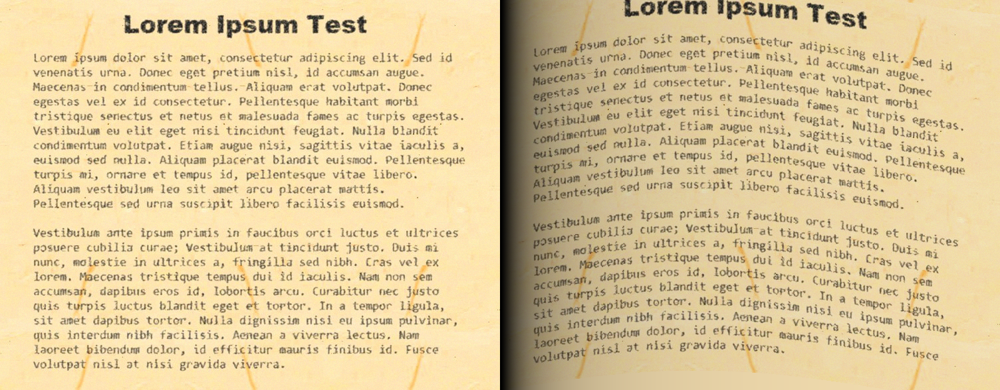

# Book Binding 
The Book Binding augmentation emulates the effect of a paper being scanned from a book by applying shadow on edges and a curved effect
## Example Usage

```
augmentation = Folding(
	radius_range=(1, 100),
	curve_intensity_range=(0, 70),
	p=0.5
	)
```

| Parameter | Description  |
|---|---|
| `radius_range` | The pixels width of the page to apply shadow on. |
| `curve_intensity_range` | Level of curve intensity of the page |
| `p` | The probability that this augmentation will be applied. |



