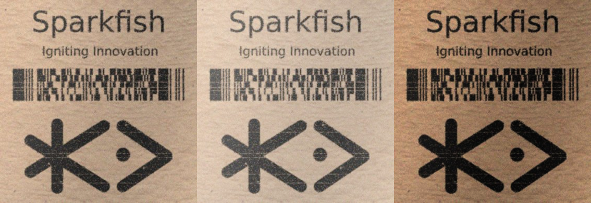

# Gamma Adjustment

The Gamma augmentation randomly applies gamma correction (from a range of values) on the image.
Note: a gamma value of 1 will not affect the image.


| Parameter | Description                                                                                                                                                        |
|-----------|--------------------------------------------------------------------------------------------------------------------------------------------------------------------|
| `range`   | Specifies the range for gamma value. Gamma value below 1 darkens the image whereas above 1 increases pixel intensities. Gamma value of 1 does not change anything. |
| `p`       | The probability that this augmentation will be applied.                                                                                                            |


**Example Usage:**
```python
    from matplotlib import pyplot as plt
    from time import time
    import cv2
    import numpy as np

    start_time = time()

    # create a blank image
    image = np.full((1500, 1500,3), 128, dtype="uint8")

    # insert text into image
    for y in range(200, 1300, 100):
        cv2.putText(
            image,
            "Lorem ipsum dolor sit amet, consectetur adipiscing elit",
            (250, y),
            cv2.FONT_HERSHEY_SIMPLEX,
            1,
            0,
            3,
        )


    gamma = Gamma(range=(2.0, 3.0))

    img_gamma = gamma(image)

    elapsed_time = time() - start_time
    # processing time
    print("Elapsed time = " + str(elapsed_time) + " seconds")


    # display output
    plt.figure()
    plt.subplot(121)
    plt.imshow(image)
    plt.title("Input image")
    plt.subplot(122)
    plt.imshow(img_gamma)
    plt.title("Gamma image")
```


**Example Result:**

In the image below, the leftmost picture is the original, the middle image is obtained by using a gamma value of 1.4, and the rightmost image is obtained by using a gamma value of 0.6.



[](https://colab.research.google.com/drive/1_h1TybFELR6-e5UeVmjRniof-PLAvyXB?usp=sharing)
