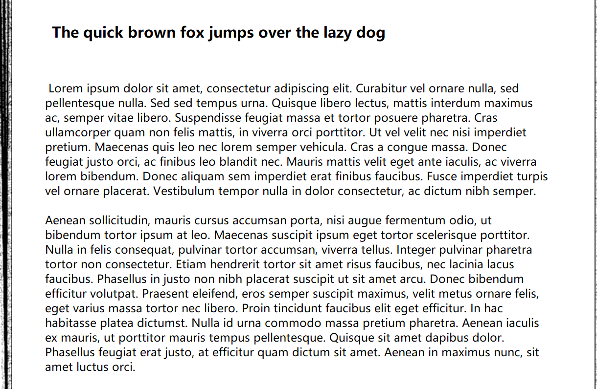

# Page Border

The Page Border augmentation applies a shadow of underlying pages on any side of the page, creating an effect of single or multiple borders on specified side of the page.


| Parameter               | Description                                                                               |
|-------------------------|-------------------------------------------------------------------------------------------|
| `side`                  | The side of the page on which the border will be drawn. One of: left, right, top, bottom. |
| `width_range`           | The width of the border.                                                                  |
| `pages`                 | The number of pages to augment in the border.                                             |
| `noise_intensity_range` | The range of noise applied around the border and pages.                                   |
| `p`                     | The probability that this augmentation will be applied.                                   |


**Example Usage:**
```python
    from matplotlib import pyplot as plt
    from time import time
    import cv2
    import numpy as np

    start_time = time()

    # create a blank image
    image = np.full((1500, 1500,3), 255, dtype="uint8")

    # insert text into image
    for y in range(200, 1300, 100):
        cv2.putText(
            image,
            "Lorem ipsum dolor sit amet, consectetur adipiscing elit",
            (250, y),
            cv2.FONT_HERSHEY_SIMPLEX,
            1,
            0,
            3,
        )


    page_border = PageBorder(
            side="random",
            width_range=(30, 50),
            pages=10,
            noise_intensity_range=(0.1, 0.3)
            )

    img_page_border = page_border(image)

    elapsed_time = time() - start_time
    # processing time
    print("Elapsed time = " + str(elapsed_time) + " seconds")


    # display output
    plt.figure()
    plt.imshow(img_page_border)
    plt.title("Image page border")
```


**Example Result:**



Click here for an [example Colab Notebook](https://colab.research.google.com/drive/1eRFCmmyoQD87ZgAeweAk5dkygS-Hk3Zu?usp=sharing)
