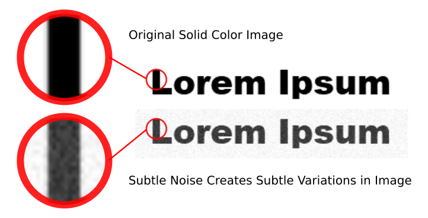

# Subtle Noise

The Subtle Noise augmentation emulates the imperfections in scanning solid colors due to subtle lighting differences.

**Example Usage:**

```python
augmentation = SubtleNoise(
	range=5,
	p=0.5
    )
```

| Parameter | Description |
|---|---|
| `range` | The range added or subtracted from each pixel value in the image. With a range of 5, a pixel with color value of 100 will end up between 95 and 105. |
| `p` | The probability that this augmentation will be applied. |

**Example Result:**

Created with a range of 25.



