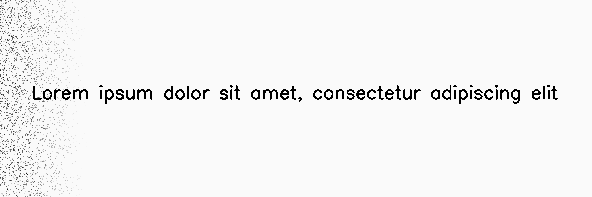
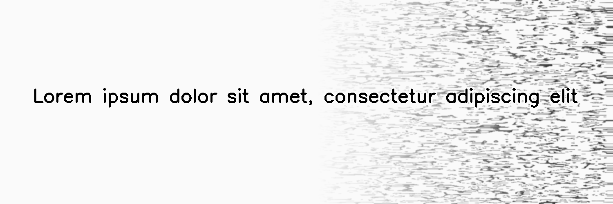
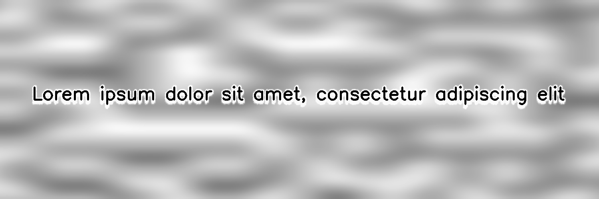
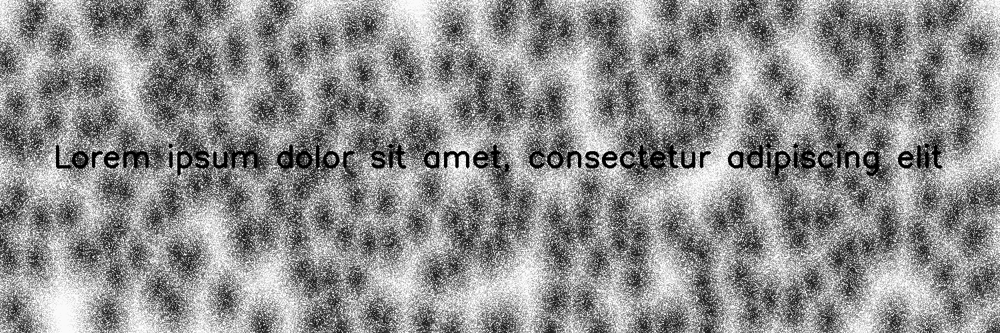
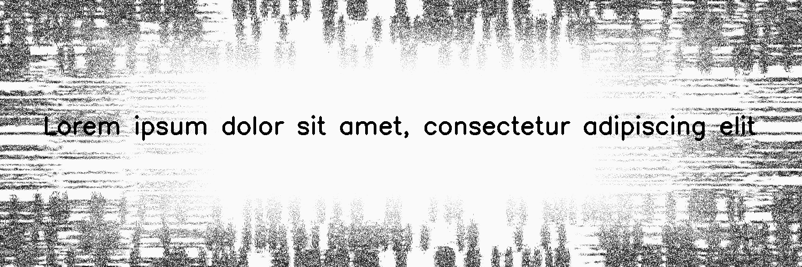

************
BadPhotoCopy
************

.. autoclass:: augraphy.augmentations.badphotocopy.BadPhotoCopy
    :members:
    :undoc-members:
    :show-inheritance:

--------
Overview
--------
There are 5 main types of noise in BadPhotoCopy augmentation:

Noise type 1 creates sklearn.datasets' make_blobs noise.
Noise type 2 creases Gaussian noise.
Noise type 3 creates Perlin noise.
Noise type 4 creates Worley noise.
Noise type 5 creates rectangular pattern noise.

Initially, a clean image with single line of text is created.

Code example:

::

    # import libraries
    import cv2
    import numpy as np
    from augraphy import *

    # create a clean image with single line of text
    image = np.full((500, 1500,3), 250, dtype="uint8")
    cv2.putText(
        image,
        "Lorem ipsum dolor sit amet, consectetur adipiscing elit",
        (80, 250),
        cv2.FONT_HERSHEY_SIMPLEX,
        1.5,
        0,
        3,
    )

    cv2.imshow("Input image", image)

Clean image:

.. figure:: augmentations/input.png

---------
Example 1
---------
In this example, a BadPhotoCopy augmentation instance is initialized with sklearn.datasets' make_blobs noise (noise_type=1) and the noise is set at the left side of the image. Noise concentation is set to low intensity (0.2, 0.3) and noise sparsity is set to a low value (0.15, 0.15). Augmentation is set to run with 2 to 3 iterations and each time the noise size is randomly set from 2 to 3. Flag to blur noise is set to random (-1).

Code example:

::

    BadPhotoCopy_type_1 = BadPhotoCopy(noise_type=1,
                                       noise_side="left",
                                       noise_iteration=(2,3),
                                       noise_size=(2,3),
                                       noise_sparsity=(0.15,0.15),
                                       noise_concentration=(0.3,0.3),
                                       blur_noise=-1,
                                       blur_noise_kernel=(5, 5),
                                       wave_pattern=0,
                                       edge_effect=0)
    img_BadPhotoCopy_type_1 = BadPhotoCopy_type_1(image)
    cv2.imshow("type1",img_BadPhotoCopy_type_1)

Augmented image:

---------
Example 2
---------
In this example, a BadPhotoCopy augmentation instance is initialized with Gaissian noise (noise_type=2) and the noise is set at the right side of the image. Noise concentation is set to low intensity (0.2, 0.2) and noise sparsity is set to a medium value (0.4, 0.5). Augmentation is set to run with single iteration (1, 1) and the noise size is set to 1. Flags to blur noise and edge effect in noise are enabled.

Code example:

::

    BadPhotoCopy_type_2 = BadPhotoCopy(noise_type=2,
                                       noise_side="right",
                                       noise_iteration=(1,1),
                                       noise_size=(1,1),
                                       noise_sparsity=(0.4,0.5),
                                       noise_concentration=(0.2,0.2),
                                       blur_noise=1,
                                       blur_noise_kernel=(5, 5),
                                       wave_pattern=0,
                                       edge_effect=1)
    img_BadPhotoCopy_type_2 = BadPhotoCopy_type_2(image)
    cv2.imshow("type2",img_BadPhotoCopy_type_2)

Augmented image:

---------
Example 3
---------
In this example, a BadPhotoCopy augmentation instance is initialized with Perlin noise(noise_type=3). Noise is apply evenly to the whole image by setting noise side = "none". Noise value is set to random value in between 128 and 255 (128, 255).
Noise concentation is set to medium intensity (0.5, 0.5) and noise sparsity is set to a low value(0.2, 0.3). Augmentation is set to run with single iteration (1, 1) and noise size is randomly set from 1 to 3 (1, 3). Flag to blur noise is enabled and flag for edge effet is set to random (-1).

Code example:

::

    BadPhotoCopy_type_3 = BadPhotoCopy(noise_type=3,
                                       noise_side="none",
                                       noise_iteration=(1,1),
                                       noise_size=(1,3),
                                       noise_value=(128, 255),
                                       noise_sparsity=(0.2,0.3),
                                       noise_concentration=(0.5,0.5),
                                       blur_noise=1,
                                       blur_noise_kernel=(5, 5),
                                       wave_pattern=0,
                                       edge_effect=1)
    img_BadPhotoCopy_type_3 = BadPhotoCopy_type_3(image)
    cv2.imshow("type3",img_BadPhotoCopy_type_3)

Augmented image:

---------
Example 4
---------
In this example, a BadPhotoCopy augmentation instance is initialized with Worley noise (noise_type=4).
Noise is apply evenly to the whole image by setting noise side = "none". Noise value is set to random value in between 32 and 255 (32, 255).
Noise concentation is set to high intensity (0.99, 0.99) and noise sparsity is set to a moderate value(0.5, 0.5). Augmentation is set to run with single iteration (1,1) and the noise size is randomly set from 1 to 3. Flag to blur noise is enabled and flag for edge effet is set to random (-1).

Code example:

::

    BadPhotoCopy_type_4 = BadPhotoCopy(noise_type=4,
                                       noise_side="none",
                                       noise_iteration=(1,1),
                                       noise_size=(1,3),
                                       noise_value=(32, 255),
                                       noise_sparsity=(0.5,0.5),
                                       noise_concentration=(0.99,0.99),
                                       blur_noise=0,
                                       wave_pattern=0,
                                       edge_effect=0)
    img_BadPhotoCopy_type_4 = BadPhotoCopy_type_4(image)
    cv2.imshow("type4",img_BadPhotoCopy_type_4)

Augmented image:

---------
Example 5
---------
In this example, a BadPhotoCopy augmentation instance is initialized with rectangular pattern noise (noise_type=5).
Noise is apply to all borders of the image by setting noise side = "all". Noise value is set to random value in between 32 and 128 (32, 128).
Noise concentation is set to medium intensity (0.5, 0.5) and noise sparsity is set to a low value(0.3, 0.3). Augmentation is set to run with single iteration (1,1) and the noise size is randomly set from 1 to 3. Flag to blur noise is enabled and flag for edge effet is set to random (-1).

Code example:

::

    BadPhotoCopy_type_5 = BadPhotoCopy(noise_type=5,
                                       noise_side="all",
                                       noise_iteration=(1,1),
                                       noise_size=(1,3),
                                       noise_value=(32, 128),
                                       noise_sparsity=(0.3,0.3),
                                       noise_concentration=(0.5,0.5),
                                       blur_noise=0,
                                       wave_pattern=0,
                                       edge_effect=0)
    img_BadPhotoCopy_type_5 = BadPhotoCopy_type_5(image)
    cv2.imshow("type5",img_BadPhotoCopy_type_5)

Augmented image:

