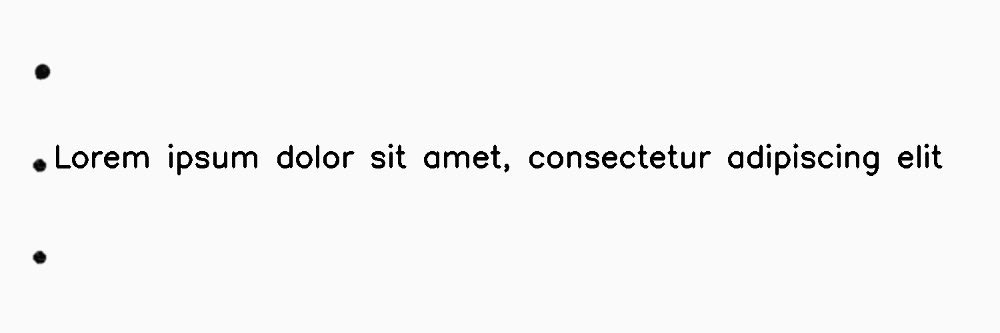
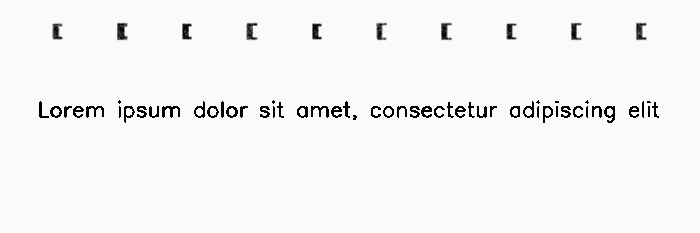
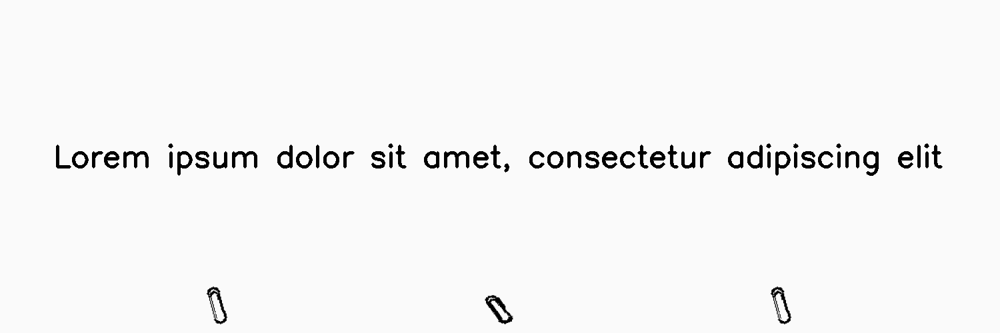
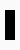
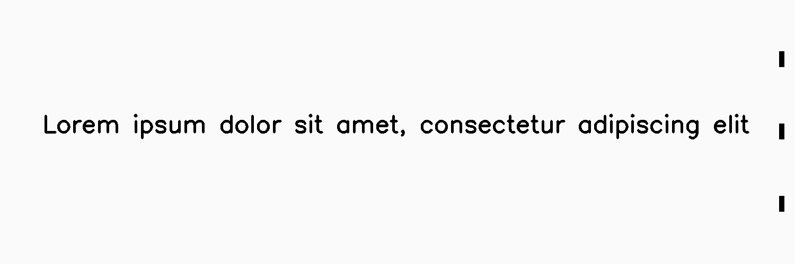

********************
BindingsAndFasteners
********************

.. autoclass:: augraphy.augmentations.bindingsandfasteners.BindingsAndFasteners
    :members:
    :undoc-members:
    :show-inheritance:

--------
Overview
--------
The Bindings And Fasteners augmentation creates binder mark in the input image. User can insert their own binder image or use the synthetic binder mark. The supported synthetic binder marks are punch holes", binding holes" and "clips".

Initially, a clean image with single line of text is created.

Code example:

::

    # import libraries
    import cv2
    import numpy as np
    from augraphy import *

    # create a clean image with single line of text
    image = np.full((500, 1500,3), 250, dtype="uint8")
    cv2.putText(
        image,
        "Lorem ipsum dolor sit amet, consectetur adipiscing elit",
        (80, 250),
        cv2.FONT_HERSHEY_SIMPLEX,
        1.5,
        0,
        3,
    )

    cv2.imshow("Input image", image)

Clean image:

.. figure:: augmentations/input.png

---------
Example 1
---------
In this example, a BindingsAndFasteners augmentation instance is initialized the binding effect is set to use a synthetic punch holes (effect_type="punch_holes").
Both of the width and height of punch holes are set to random value in between 70 to 80 pixels (70, 80).
The punch holes mark is set to bind 3 times (3,3) and with scale of 1.5 (1.5,1.5).
The effect is set at the left edge and with random offset range of 30 to 50 pixels from the chosen edge.

Code example:

::

    binder_punch_holes = BindingsAndFasteners(overlay_types="darken",
                                              foreground=None,
                                              effect_type="punch_holes",
	                                      width_range = (70,80),
	                                      height_range = (70,80),
                                              ntimes=(3, 3),
                                              nscales=(1.5, 1.5),
                                              edge="left",
                                              edge_offset=(30,50),
                                              use_figshare_library=0,
                                              )

    img_punch_holes =binder_punch_holes(image)
    cv2.imshow("punch_holes", img_punch_holes)

Augmented image:

---------
Example 2
---------
In this example, a BindingsAndFasteners augmentation instance is initialized and it is using a synthetic binding holes mark.
Both of the width and height of binders are set to random ("random").
The binding holes mark is set to bind 9 to 10 times (9,10) and with scale of 1 to 2 (1,2).
The effect is set at the left edge and with random offset range of 30 to 50 pixels from the chosen edge.

Code example:

::

    binder_binding_holes = BindingsAndFasteners(overlay_types="darken",
                                                foreground=None,
                                                effect_type="binding_holes",
	                                        width_range = "random",
	                                        height_range = "random",
                                                ntimes=(9, 10),
                                                nscales=(1, 2),
                                                edge="top",
                                                edge_offset=(40,50),
                                                use_figshare_library=0,
                                                )

    img_binding_holes =binder_binding_holes(image)
    cv2.imshow("binding_holes", img_binding_holes)

Augmented image:

---------
Example 3
---------
In this example, a BindingsAndFasteners augmentation instance is initialized and it is using a synthetic binding clips mark.
Both of the width and height of clips are set to random ("random").
The binding clips mark is set to bind 2 to 3 times (2,3) and with scale of 1 to 2 (1,2).
The effect is set to random edge and with random offset range of 10 to 20 pixels from the edge.

Code example:

::

    binder_binding_clips = BindingsAndFasteners(overlay_types="darken",
                                                foreground=None,
                                                effect_type="clips",
	                                        width_range = "random",
	                                        height_range = "random",
                                                ntimes= (2, 3),
                                                nscales=(1, 2),
                                                edge="random",
                                                edge_offset=(10,20),
                                                use_figshare_library=0,
                                                )

    img_binding_clips = binder_binding_clips(image)
    cv2.imshow("clips",img_binding_clips)

Augmented image:

---------
Example 4
---------
In this example, a BindingsAndFasteners augmentation instance is initialized and it is using a new binder image.
The binder is set to bind 2 to 3 times (2,3) and with scale of 1 to 2 (1,2).
The effect is set to right edge and with random offset range of 10 to 20 pixels from the edge.

Code example:

::

    binder_rectangle = np.full((50,20),fill_value=250,dtype="uint8")
    binder_rectangle[10:40,5:15] = 0

    user_binder_clips = BindingsAndFasteners(overlay_types="darken",
                                             foreground=binder_rectangle,
                                             ntimes= (2, 3),
                                             nscales=(1, 2),
                                             edge="right",
                                             edge_offset=(10,20),
                                             use_figshare_library=0,
                                             )

    img_user_binder = user_binder_clips(image)
    cv2.imshow("user binders",img_user_binder)

A newly created binder:

Augmented image:

