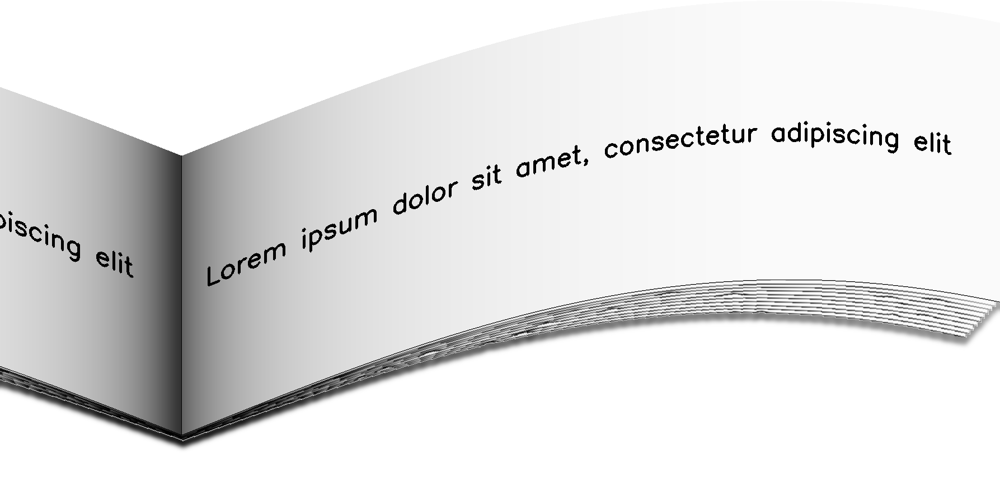
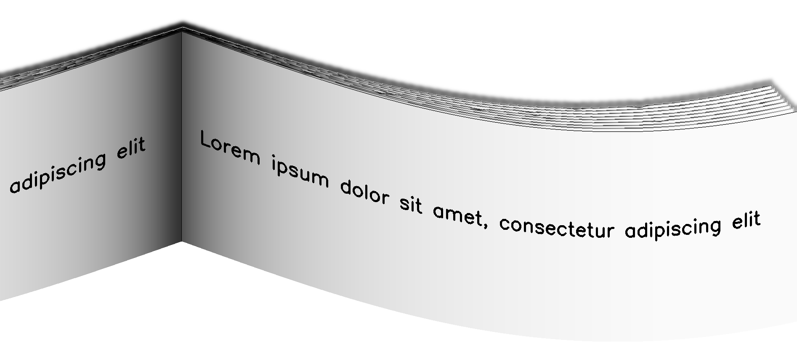

***********
BookBinding
***********

.. autoclass:: augraphy.augmentations.bookbinding.BookBinding
    :members:
    :undoc-members:
    :show-inheritance:

--------
Overview
--------
The BookBinding augmentation creates the effect of a page curling away from the scanner bed, towards the binding of a book or magazine. Right now it supports 2 variants of page curling direction.

Initially, a clean image with single line of text is created.

Code example:

::

    # import libraries
    import cv2
    import numpy as np
    from augraphy import *

    # create a clean image with single line of text
    image = np.full((500, 1500,3), 250, dtype="uint8")
    cv2.putText(
        image,
        "Lorem ipsum dolor sit amet, consectetur adipiscing elit",
        (80, 250),
        cv2.FONT_HERSHEY_SIMPLEX,
        1.5,
        0,
        3,
    )

    cv2.imshow("Input image", image)

Clean image:

.. figure:: augmentations/input.png

---------
Example 1
---------
In this example, a BookBinding augmentation instance is initialized and the curling direction is set to bend up (curling_direction=0).
The shadow radius range is set to 100 pixels (100,100).
The amount of curving down pixels in the right image is set to 50 (50, 50) while The amount of curving down pixels in the left image is set to 300 (300, 300).
The horizontal bending ratio in right image is 10% (0.1, 0.1) while the horizontal bending ratio in left image is 50% (0.5, 0.5).
The percentage of left page mirroring for the binding effect is set to the 100% (1, 1).
The pages in the book binding effect is set to align randomly (binding_align = 0) and the number of pages is set to 10 (10, 10).
The backdrop color of the effect is set to white color (255, 255, 255).
No cache images will be used to generate the pages (use_cache_images = 0).

Code example:

::

    book_binder_up = BookBinding(shadow_radius_range=(100, 100),
                                 curve_range_right=(50, 50),
                                 curve_range_left=(300, 300),
                                 curve_ratio_right = (0.1, 0.1),
                                 curve_ratio_left = (0.5, 0.5),
                                 mirror_range=(1.0, 1.0),
                                 binding_align = 0,
                                 binding_pages = (10,10),
                                 curling_direction=0,
                                 backdrop_color=(255, 255, 255),
                                 use_cache_images = 0,
                                 )

    img_book_binding_up= book_binder_up(image)
    cv2.imshow("book_binding_up", img_book_binding_up)

Augmented image:

---------
Example 2
---------
In this example, a BookBinding augmentation instance is initialized and the curling direction is set to bend down (curling_direction=1).
The shadow radius range is set to 100 pixels (100,100).
The amount of curving down pixels in the right image is set to 50 (50, 50) while The amount of curving down pixels in the left image is set to 300 (300, 300).
The horizontal bending ratio in right image is 5% (0.05, 0.05) while the horizontal bending ratio in left image is 30% (0.3, 0.3).
The percentage of left page mirroring for the binding effect is set to the 50% (0.5, 0.5).
The pages in the book binding effect is set to align properly (binding_align = 1) and the number of pages is set to 10 (10, 10).
The backdrop color of the effect is set to white color (255, 255, 255).
No cache images will be used to generate the pages (use_cache_images = 0).

Code example:

::

    book_binder_down = BookBinding(shadow_radius_range=(100, 100),
                                 curve_range_right=(50, 50),
                                 curve_range_left=(300, 300),
                                 curve_ratio_right = (0.05, 0.05),
                                 curve_ratio_left = (0.3, 0.3),
                                 mirror_range=(0.50, 0.50),
                                 binding_align = 1,
                                 binding_pages = (10,10),
                                 curling_direction=1,
                                 backdrop_color=(255, 255, 255),
                                 use_cache_images = 0,
                                 )

    img_book_binding_down= book_binder_down(image)

Augmented image:

