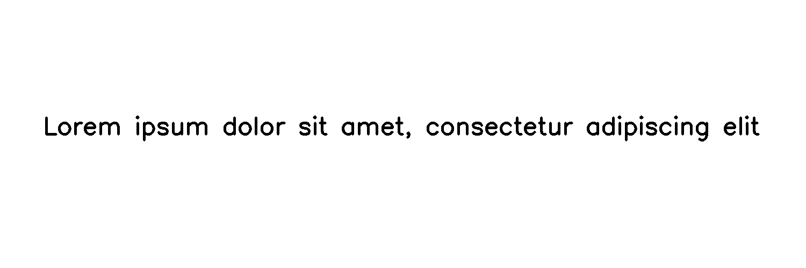

**********
Brightness
**********

.. autoclass:: augraphy.augmentations.brightness.Brightness
    :members:
    :undoc-members:
    :show-inheritance:

--------
Overview
--------
The Brightness augmentation adjusts the brightness of the whole image by a chosen multiplier.

Initially, a clean image with single line of text is created.

Code example:

::

    # import libraries
    import cv2
    import numpy as np
    from augraphy import *
    
    
    # create a clean image with single line of text
    image = np.full((500, 1500,3), 250, dtype="uint8")
    cv2.putText(
        image,
        "Lorem ipsum dolor sit amet, consectetur adipiscing elit",
        (80, 250),
        cv2.FONT_HERSHEY_SIMPLEX,
        1.5,
        0,
        3,
    )
    
    cv2.imshow("Input image", image)

Clean image:

.. figure:: augmentations/input.png

---------
Example 1
---------
In this example, a Brightness augmentation instance is initialized and the brightness range is set to 1.5 to 2 (1.5, 2) times of original brightness. 
Flag to enable min brightness is disabled.

Code example:

::

    brightness_brighten= Brightness(brightness_range=(1.5, 2),
                           min_brightness=0,
                        )
    
    img_brightness_brighten= brightness_brighten(image)
    cv2.imshow("brightness_brighten", img_brightness_brighten)

Augmented image:

---------
Example 2
---------
In this example, a Brightness augmentation instance is initialized and the brightness range is set to 0.2 to 0.8 (0.2, 0.8) times of original brightness. 
Flag to enable min brightness is enabled (1) and the minimum pixel value is set to between 120 to 150 (120,150).

Code example:

::

    brightness_dimmer= Brightness(brightness_range=(0.2, 0.8),
                                    min_brightness=1,
                                    min_brightness_value=(120, 150),
                            )
    
    img_brightness_dimmer= brightness_dimmer(image)
    cv2.imshow("brightness_dimmer", img_brightness_dimmer)

Augmented image:

