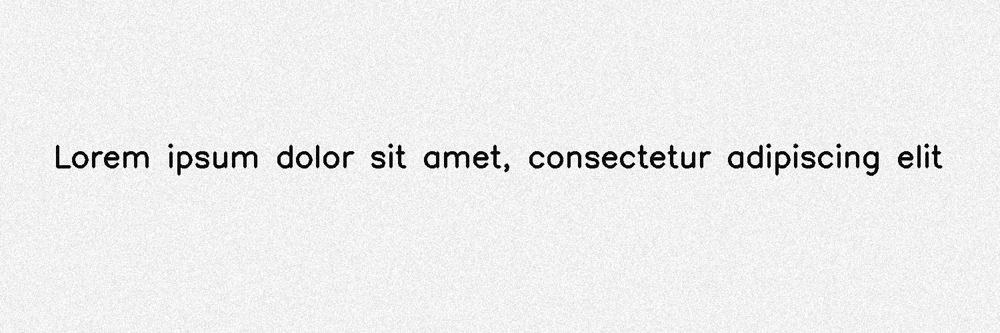

*******************
BrightnessTexturize
*******************

.. autoclass:: augraphy.augmentations.brightnesstexturize.BrightnessTexturize
    :members:
    :undoc-members:
    :show-inheritance:

--------
Overview
--------
The Brightness Texturize augmentation creates a random noise in the brightness channel to emulate paper textures.

Initially, a clean image with single line of text is created.

Code example:

::

    # import libraries
    import cv2
    import numpy as np
    from augraphy import *
    
    
    # create a clean image with single line of text
    image = np.full((500, 1500,3), 250, dtype="uint8")
    cv2.putText(
        image,
        "Lorem ipsum dolor sit amet, consectetur adipiscing elit",
        (80, 250),
        cv2.FONT_HERSHEY_SIMPLEX,
        1.5,
        0,
        3,
    )
    
    cv2.imshow("Input image", image)

Clean image:

.. figure:: augmentations/input.png

---------
Example 1
---------
In this example, a BrightnessTexturize augmentation instance is initialized and the texturize range is set to high value (0.9, 0.99.
The deviation of adjusted texturization is set to 10% (0.1).
Code example:

::

    brightness_texturize = BrightnessTexturize(texturize_range=(0.9, 0.99), 
                                               deviation=0.1 )
    
    img_brightness_texturize = brightness_texturize(image)
    cv2.imshow("brightness_texturize", img_brightness_texturize)

Augmented image:

