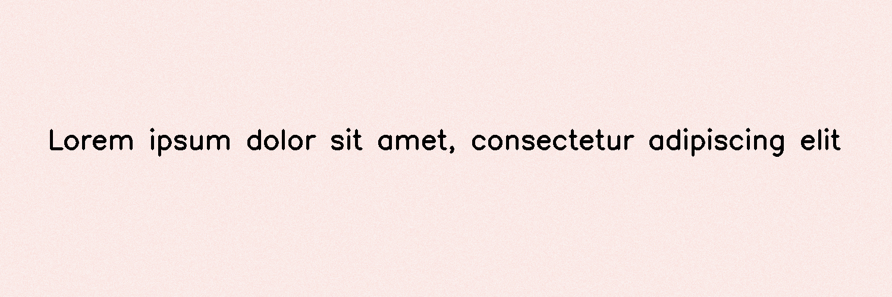

**********
ColorPaper
**********

.. autoclass:: augraphy.augmentations.colorpaper.ColorPaper
    :members:
    :undoc-members:
    :show-inheritance:

--------
Overview
--------
The ColorPaper augmentation change color of input paper based on user input hue and saturation. Right now it supports only HSV colorspace.

Initially, a clean image with single line of text is created.

Code example:

::

    # import libraries
    import cv2
    import numpy as np
    from augraphy import *
    
    
    # create a clean image with single line of text
    image = np.full((500, 1500,3), 250, dtype="uint8")
    cv2.putText(
        image,
        "Lorem ipsum dolor sit amet, consectetur adipiscing elit",
        (80, 250),
        cv2.FONT_HERSHEY_SIMPLEX,
        1.5,
        0,
        3,
    )
    
    cv2.imshow("Input image", image)

Clean image:

.. figure:: augmentations/input.png

---------
Example 1
---------
In this example, a ColorPaper augmentation instance is initialized and the hue changes range is set to red color (0, 10).
The saturation changes range is set to low value (10,30).

Code example:

::

    colorpaper= ColorPaper(hue_range=(0, 10), saturation_range=(10,30))
    
    img_colorpaper = colorpaper(image)
    cv2.imshow("colorpaper", img_colorpaper)

Augmented image:

