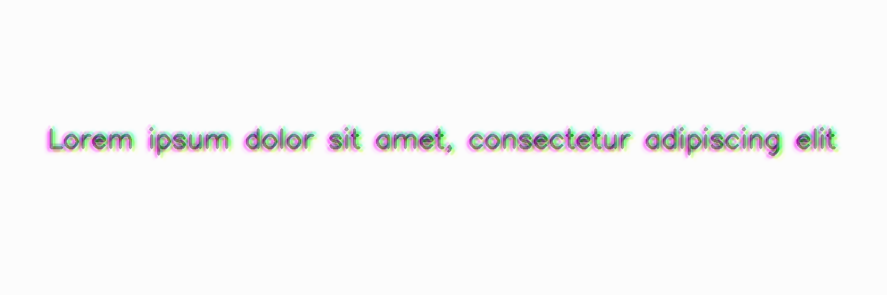

**********
ColorShift
**********

.. autoclass:: augraphy.augmentations.colorshift.ColorShift
    :members:
    :undoc-members:
    :show-inheritance:

--------
Overview
--------
The ColorShift augmentation shifts each color channel by certain offsets to create a shifted color effect.

Initially, a clean image with single line of text is created.

Code example:

::

    # import libraries
    import cv2
    import numpy as np
    from augraphy import *

    # create a clean image with single line of text
    image = np.full((500, 1500,3), 250, dtype="uint8")
    cv2.putText(
        image,
        "Lorem ipsum dolor sit amet, consectetur adipiscing elit",
        (80, 250),
        cv2.FONT_HERSHEY_SIMPLEX,
        1.5,
        0,
        3,
    )

    cv2.imshow("Input image", image)

Clean image:

.. figure:: augmentations/input.png

---------
Example 1
---------
In this example, a ColorShift augmentation instance is initialized and the shifting offset in both horizontal and vertical direction is set to random value in between 3 and 5 (3,5).
The number of color shift iterations is set randomly to 1 or 2 times (1,2).
The brightness range of the shifted color channel is set to any random value between 0.9 and 1.1 (0.9, 1.1).
The Gaussian kernel value in blurring the shifted color channel is set to 3 (3,3).

The saturation changes range is set to low value (10,30).

Code example:

::

    colorshift = ColorShift(color_shift_offset_x_range = (3,5),
                            color_shift_offset_y_range = (3,5),
                            color_shift_iterations = (1,2),
                            color_shift_brightness_range = (0.9,1.1),
                            color_shift_gaussian_kernel_range = (3,3),
                            )

    img_colorshift = colorshift(image)
    cv2.imshow("colorshift", img_colorshift)

Augmented image:

