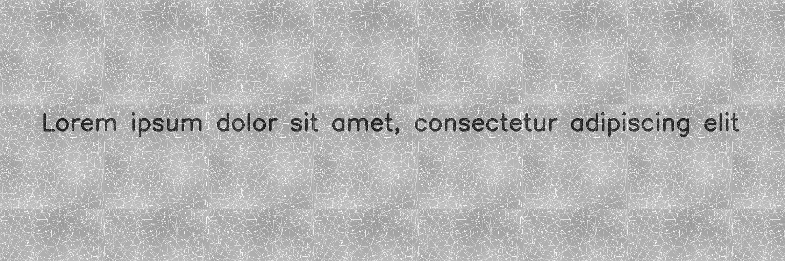
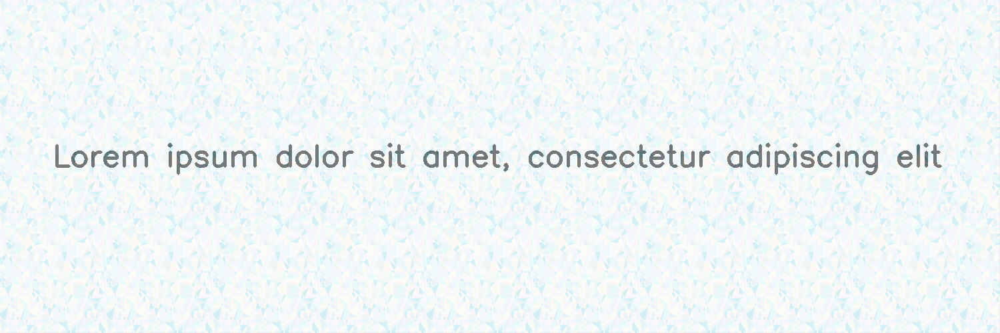

**********
DelaunayTessellation
**********

.. autoclass:: augraphy.augmentations.delaunay.DelaunayTessellation
    :members:
    :undoc-members:
    :show-inheritance:

--------
Overview
--------
The Delaunay augmentation applies Delaunay Tessellation with Perlin Noise by default, creating organic looking background patterns.
Initially, a clean image with a single line of text is created.

Code example:

::

    # import libraries
    import cv2
    import numpy as np
    from augraphy import *

    # create a clean image with single line of text
    image = np.full((500, 1500,3), 250, dtype="uint8")
    cv2.putText(
        image,
        "Lorem ipsum dolor sit amet, consectetur adipiscing elit",
        (80, 250),
        cv2.FONT_HERSHEY_SIMPLEX,
        1.5,
        0,
        3,
    )

    cv2.imshow("Input image", image)

Clean image:

.. figure:: augmentations/input.png

---------
Example 1
---------
In this example, a Delaunay Tessellation instance with  Noise type is set to "random", if the perlin is selected (randomly) from the algorithm, a background pattern is created
and the patch is passed through the original image like a Sliding Window. The range of number of points on the geometric plane is set in between 500 and 800. The range of
number of horizontal edge points is set between 50 and 100. The range of number of vertical points is set between 50 and 100.

Code example:

::

    delaunay_pattern = DelaunayTessellation(
                                            n_points_range = (500, 800),
                                            n_horizontal_points_range=(50, 100),
                                            n_vertical_points_range=(50, 100),
                                            noise_type = "random")

    img_final = delaunay_pattern(image)
    cv2.imshow("Delaunay Image", img_final)

Augmented image:

`Delaunay Tessellation pattern_width = 480, pattern_height= 480, no. of random points on geometric plane = 502, no. of horizontal edge points = 65, no. of vertical edge points = 68, perlin_noise = True, window_size = 120`

`Delaunay Tessellation pattern_width = 640, pattern_height= 640, no. of random points on geometric plane = 661, no. of horizontal edge points = 86, no. of vertical edge points = 73, perlin_noise = False, window_size = 160`
