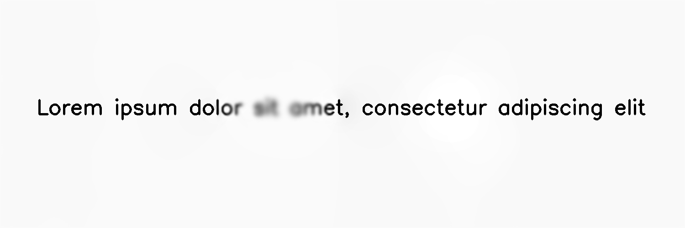

******************
DepthSimulatedBlur
******************

.. autoclass:: augraphy.augmentations.depthsimulatedblur.DepthSimulatedBlur
    :members:
    :undoc-members:
    :show-inheritance:

--------
Overview
--------
The DepthSimulatedBlur augmentation creates a depth-simulated blur effect from a camera by blurring a small elliptical region of image

Initially, a clean image with single line of text is created.

Code example:

::

    # import libraries
    import cv2
    import numpy as np
    from augraphy import *

    # create a clean image with single line of text
    image = np.full((500, 1500,3), 250, dtype="uint8")
    cv2.putText(
        image,
        "Lorem ipsum dolor sit amet, consectetur adipiscing elit",
        (80, 250),
        cv2.FONT_HERSHEY_SIMPLEX,
        1.5,
        0,
        3,
    )

    cv2.imshow("Input image", image)

Clean image:

.. figure:: augmentations/input.png

---------
Example 1
---------
In this example, a DepthSimulatedBlur augmentation instance is initialized and blur center is set to random location (blur_center = "random"). The blurring ellipse's major and minor axes are to random value in between 120 and 200 (120,200).

Code example:

::

    depthsimulatedblur = DepthSimulatedBlur(blur_center = "random",
                                            blur_major_axes_length_range = (120, 200),
                                            blur_minor_axes_length_range = (120, 200),
                                            )

    img_depthsimulatedblur = depthsimulatedblur(image)
    cv2.imshow("depthsimulatedblur", img_depthsimulatedblur)

Augmented image:

