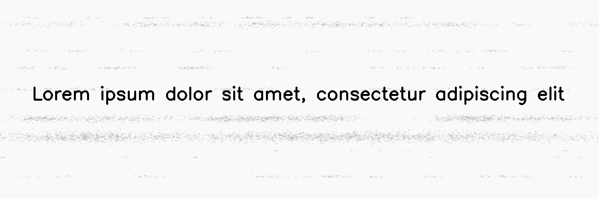
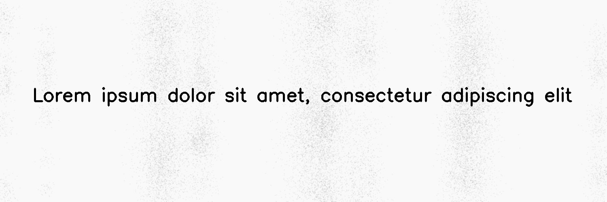
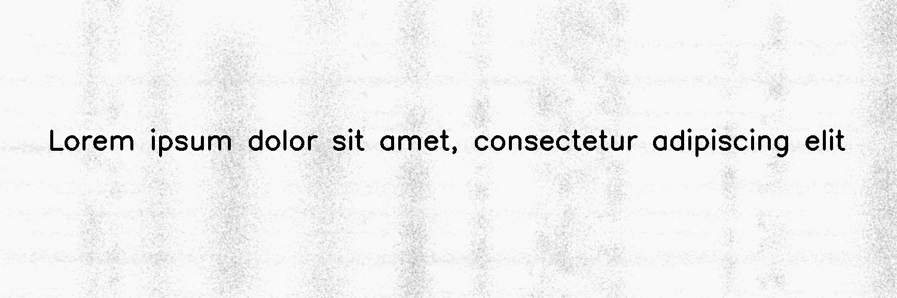

************
DirtyDrum
************

.. autoclass:: augraphy.augmentations.dirtydrum.DirtyDrum
    :members:
    :undoc-members:
    :show-inheritance:

--------
Overview
--------
The Dirty Drum augmentation emulates deposits of dirt and ink-grime from dirty printer drums. It supports dirty drum effect in vertical, horizonal and both vertical and horizontal direction now.

Initially, a clean image with single line of text is created.

Code example:

::

    # import libraries
    import cv2
    import numpy as np
    from augraphy import *

    # create a clean image with single line of text
    image = np.full((500, 1500,3), 250, dtype="uint8")
    cv2.putText(
        image,
        "Lorem ipsum dolor sit amet, consectetur adipiscing elit",
        (80, 250),
        cv2.FONT_HERSHEY_SIMPLEX,
        1.5,
        0,
        3,
    )

    cv2.imshow("Input image", image)

Clean image:

.. figure:: augmentations/input.png

---------
Example 1
---------
In this example, a DirtyDrum augmentation instance is initialized and the direction of dirty drum effect is set to horizontal (0).
Each line width is set to between 1 to 4 pixels (1,4) and the line concentration is set to low value (0, 1).
Noise intensity is set to moderate value (0.5) and the noise intensity value is set to between 0 and 30 (0, 30).

Code example:

::

    dirtydrum1 = DirtyDrum(line_width_range=(1, 4),
                          line_concentration=0.1,
                          direction=0,
                          noise_intensity=0.5,
                          noise_value=(0, 30),
                          ksize=(3, 3),
                          sigmaX=0,
                          )

    img_dirtydrum1 = dirtydrum1(image)
    cv2.imshow("dirtydrum1", img_dirtydrum1)

Augmented image:

---------
Example 2
---------
In this example, a DirtyDrum augmentation instance is initialized and the direction of dirty drum effect is set to vertical (1).
Each line width is set to between 5 to 10 pixels (5,10) and the line concentration is set to low value (0.3).
Noise intensity is set to low value (0.2) and the noise intensity value is set to between 0 and 10 (0, 10).

Code example:

::

    dirtydrum2 = DirtyDrum(line_width_range=(5, 10),
                          line_concentration=0.3,
                          direction=1,
                          noise_intensity=0.2,
                          noise_value=(0, 10),
                          ksize=(3, 3),
                          sigmaX=0,
                          )

    img_dirtydrum2 = dirtydrum2(image)
    cv2.imshow("dirtydrum2", img_dirtydrum2)

Augmented image:

---------
Example 3
---------
In this example, a DirtyDrum augmentation instance is initialized and the direction of dirty drum effect is set to both vertical and horizontal direction (2).
Each line width is set to between 2 to 5 pixels (2,5) and the line concentration is set to low value (0.3).
Noise intensity is set to moderate value (0.4) and the noise intensity value is set to between 0 and 5 (0, 5).

Code example:

::

    dirtydrum3 = DirtyDrum(line_width_range=(2, 5),
                          line_concentration=0.3,
                          direction=2,
                          noise_intensity=0.4,
                          noise_value=(0, 5),
                          ksize=(3, 3),
                          sigmaX=0,
                          )

    img_dirtydrum3 = dirtydrum3(image)
    cv2.imshow("dirtydrum3", img_dirtydrum3)

Augmented image:

