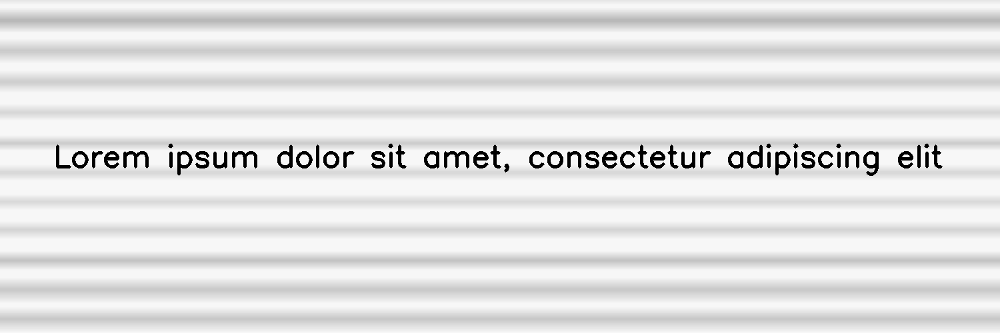

************
DirtyRollers
************

.. autoclass:: augraphy.augmentations.dirtyrollers.DirtyRollers
    :members:
    :undoc-members:
    :show-inheritance:

--------
Overview
--------
The Dirty Rollers augmentation emulates an effect created by certain document scanners.

Initially, a clean image with single line of text is created.

Code example:

::

    # import libraries
    import cv2
    import numpy as np
    from augraphy import *
    
    
    # create a clean image with single line of text
    image = np.full((500, 1500,3), 250, dtype="uint8")
    cv2.putText(
        image,
        "Lorem ipsum dolor sit amet, consectetur adipiscing elit",
        (80, 250),
        cv2.FONT_HERSHEY_SIMPLEX,
        1.5,
        0,
        3,
    )
    
    cv2.imshow("Input image", image)

Clean image:

.. figure:: augmentations/input.png

---------
Example 1
---------
In this example, a DirtyRollers augmentation instance is initialized and the line width of dirty rollers effect is set to between 12 and 25 pixels (12,25).
Scanline type is set to 0 (0) for white image background.

Code example:

::

    dirty_rollers = DirtyRollers(line_width_range=(12, 25),
                                scanline_type=0,
                                )
    
    img_dirty_rollers = dirty_rollers(image)
    cv2.imshow("dirty_rollers", img_dirty_rollers)

Augmented image:

