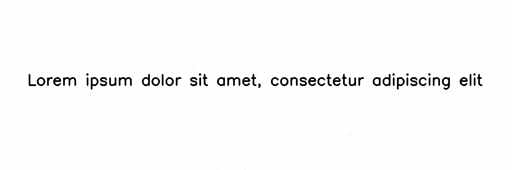

***********
DirtyScreen
***********

.. autoclass:: augraphy.augmentations.dirtyscreen.DirtyScreen
    :members:
    :undoc-members:
    :show-inheritance:

--------
Overview
--------
The DirtyScreen augmentation creates a dirty screen effect by applying blobs of different size in the entire image.

Initially, a clean image with single line of text is created.

Code example:

::

    # import libraries
    import cv2
    import numpy as np
    from augraphy import *

    # create a clean image with single line of text
    image = np.full((500, 1500,3), 250, dtype="uint8")
    cv2.putText(
        image,
        "Lorem ipsum dolor sit amet, consectetur adipiscing elit",
        (80, 250),
        cv2.FONT_HERSHEY_SIMPLEX,
        1.5,
        0,
        3,
    )

    cv2.imshow("Input image", image)

Clean image:

.. figure:: augmentations/input.png

---------
Example 1
---------
In this example, a DirtyScreen augmentation instance is initialized. The number of noise cluster is set to random value in between 50 and 100 (50, 100).
The number of points in each cluster is set to random value in between 2 and 20 (2,20). The size of each cluster is set to small size (std_range = (1,5)).
The value of points is set to random value in between 150 and 250 (150,250).

Code example:

::

    dirtyscreen = DirtyScreen(n_clusters = (50,100),
							  n_samples = (2,20),
							  std_range = (1,5),
							  value_range = (150,250),
                              )

    img_dirtyscreen = dirtyscreen(image)
    cv2.imshow("dirtyscreen", img_dirtyscreen)

Augmented image:

