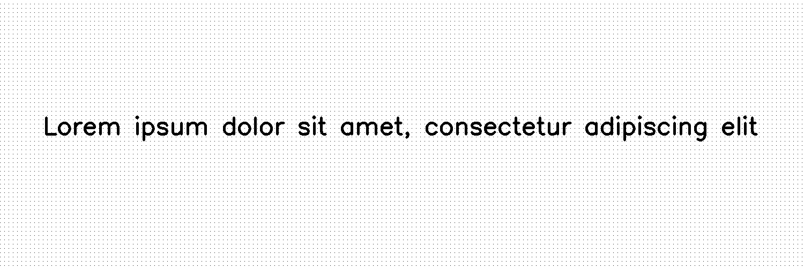
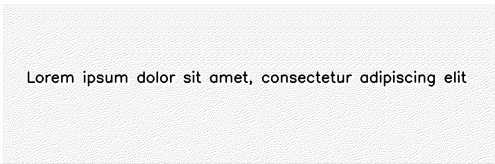

*********
Dithering
*********

.. autoclass:: augraphy.augmentations.dithering.Dithering
    :members:
    :undoc-members:
    :show-inheritance:

--------
Overview
--------
The Dithering augmentation applies Ordered or Floyd Steinberg dithering to the input image.

Initially, a clean image with single line of text is created.

Code example:

::

    # import libraries
    import cv2
    import numpy as np
    from augraphy import *

    # create a clean image with single line of text
    image = np.full((500, 1500,3), 250, dtype="uint8")
    cv2.putText(
        image,
        "Lorem ipsum dolor sit amet, consectetur adipiscing elit",
        (80, 250),
        cv2.FONT_HERSHEY_SIMPLEX,
        1.5,
        0,
        3,
    )

    cv2.imshow("Input image", image)

Clean image:

.. figure:: augmentations/input.png

---------
Example 1
---------
In this example, a Dithering augmentation instance is initialized and it is set to ordered dithering effect.
The order of dithering is set to 8.

Code example:

::

    dirther_ordered = Dithering(dither="ordered",
                                order=8,
                                )

    img_dither_ordered = dirther_ordered(image)
    cv2.imshow("dither_ordered", img_dither_ordered)

Augmented image:

---------
Example 2
---------
In this example, a Dithering augmentation instance is initialized and it is set to Floyd Steinberg dithering effect.

Code example:

::

    dirther_floyd = Dithering(dither="floyd" )

    img_dither_floyd = dirther_floyd(image)
    cv2.imshow("dither_floyd", img_dither_floyd)

Augmented image:

