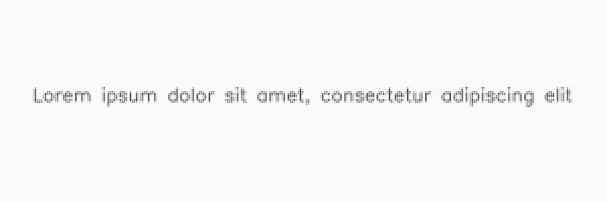

*********
DotMatrix
*********

.. autoclass:: augraphy.augmentations.dotmatrix.DotMatrix
    :members:
    :undoc-members:
    :show-inheritance:

--------
Overview
--------
The DotMatrix augmentation Create a dot matrix image by filling image with dots of mean color in different shapes.

Initially, a clean image with single line of text is created.

Code example:

::

    # import libraries
    import cv2
    import numpy as np
    from augraphy import *

    # create a clean image with single line of text
    image = np.full((500, 1500,3), 250, dtype="uint8")
    cv2.putText(
        image,
        "Lorem ipsum dolor sit amet, consectetur adipiscing elit",
        (80, 250),
        cv2.FONT_HERSHEY_SIMPLEX,
        1.5,
        0,
        3,
    )

    cv2.imshow("Input image", image)

Clean image:

.. figure:: augmentations/input.png

---------
Example 1
---------
In this example, a DotMatrix augmentation instance is initialized and the shape of dot matrix effect is set to circle ("circle").
The width and height of each dot in dot matrix effect is set to 7 pixels (7,7).
The Gaussian kernel value to blur each dot of dot matrix effect is set to 5 (5,5).
There is no rotation in each dot of the dot matrix effect (0,0).

Code example:

::

    dotmatrix = DotMatrix(dot_matrix_shape = "circle",
                          dot_matrix_dot_width_range = (7, 7),
                          dot_matrix_dot_height_range = (7, 7),
                          dot_matrix_gaussian_kernel_value_range = (5,5),
                          dot_matrix_rotate_value_range = (0,0),
                          )

    img_dotmatrix = dotmatrix(image)
    cv2.imshow("dotmatrix", img_dotmatrix)

Augmented image:

