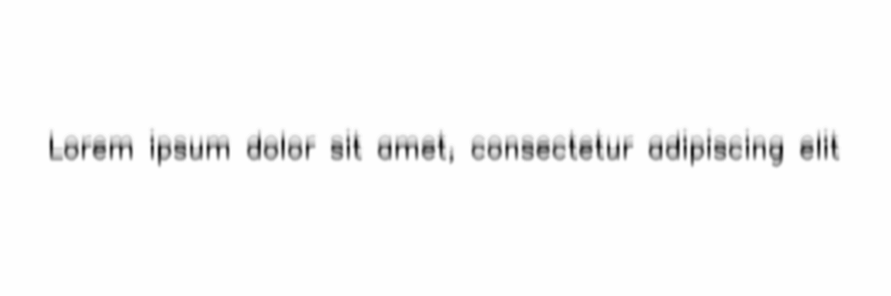

**************
DoubleExposure
**************

.. autoclass:: augraphy.augmentations.doubleexposure.DoubleExposure
    :members:
    :undoc-members:
    :show-inheritance:

--------
Overview
--------
The DoubleExposure augmentation emulates double exposure effect when taking picture with phone camera.

Initially, a clean image with single line of text is created.

Code example:

::

    # import libraries
    import cv2
    import numpy as np
    from augraphy import *

    # create a clean image with single line of text
    image = np.full((500, 1500,3), 250, dtype="uint8")
    cv2.putText(
        image,
        "Lorem ipsum dolor sit amet, consectetur adipiscing elit",
        (80, 250),
        cv2.FONT_HERSHEY_SIMPLEX,
        1.5,
        0,
        3,
    )

    cv2.imshow("Input image", image)

Clean image:

.. figure:: augmentations/input.png

---------
Example 1
---------
In this example, a DoubleExposure augmentation instance is initialized and the exposure direction is set to vertical (offset_direction=1）。
The gaussian kernel is set to random value in between 9 and 12 (9,12) and the offset is set of random value in between 18 and 25 pixels (18,25).

Code example:

::

    doubleexposure = DoubleExposure(gaussian_kernel_range=(9,12),
			            offset_direction=1,
				    offset_range=(18,25),
			            )

    img_doubleexposure = doubleexposure(image)
    cv2.imshow("doubleexposure", img_doubleexposure)

Augmented image:

