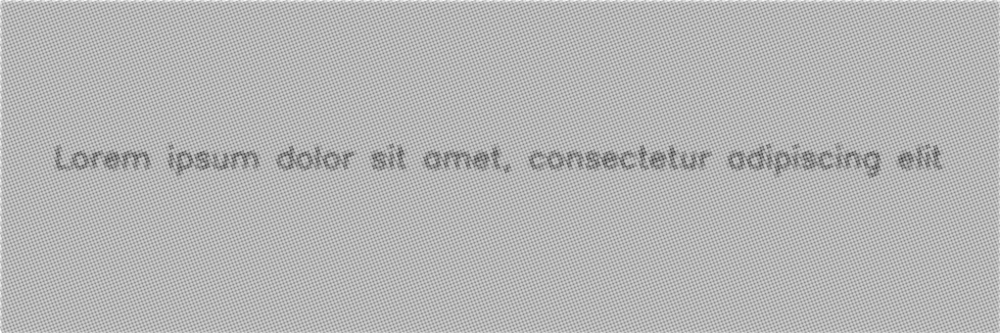

******
Faxify
******

.. autoclass:: augraphy.augmentations.faxify.Faxify
    :members:
    :undoc-members:
    :show-inheritance:

--------
Overview
--------
The Faxify augmentation emulates the artifacts created by faxing the document.

Initially, a clean image with single line of text is created.

Code example:

::

    # import libraries
    import cv2
    import numpy as np
    from augraphy import *

    # create a clean image with single line of text
    image = np.full((500, 1500,3), 250, dtype="uint8")
    cv2.putText(
        image,
        "Lorem ipsum dolor sit amet, consectetur adipiscing elit",
        (80, 250),
        cv2.FONT_HERSHEY_SIMPLEX,
        1.5,
        0,
        3,
    )

    cv2.imshow("Input image", image)

Clean image:

.. figure:: augmentations/input.png

---------
Example 1
---------
In this example, a Faxify augmentation instance is initialized and it is set to opencv thresholding method ("cv2.threshold") for monochrome effect.
Halftone effect is enable (1) and halftone half kernel size is set to 2 (2,2).
Halftone angle is set randomly between 0 to 360 degree (0, 360) and the sigma value of Gaussian blur is to random value between 1 and 3 (1,3).

Code example:

::

    faxify = Faxify(scale_range = (1,2),
                    monochrome = 1,
                    monochrome_method = "cv2.threshold",
                    monochrome_arguments = {"thresh":128, "maxval":128, "type":cv2.THRESH_BINARY},
                    halftone = 1,
                    invert = 1,
                    half_kernel_size = (2,2),
                    angle = (0, 360),
                    sigma = (1,3))

    img_faxify = faxify(image)
    cv2.imshow("faxify", img_faxify)

Augmented image:

