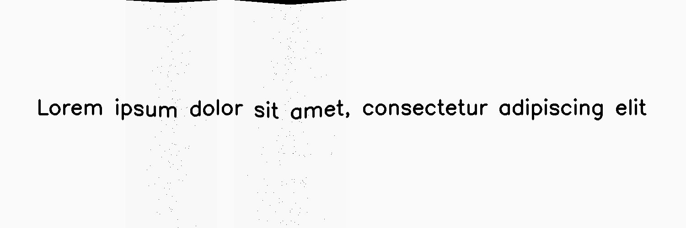
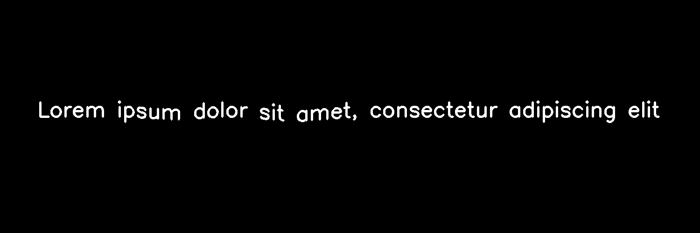
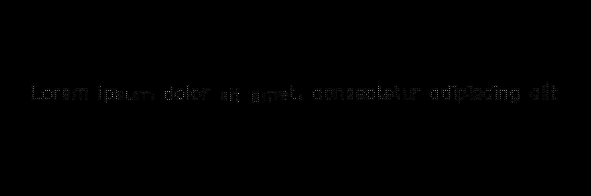
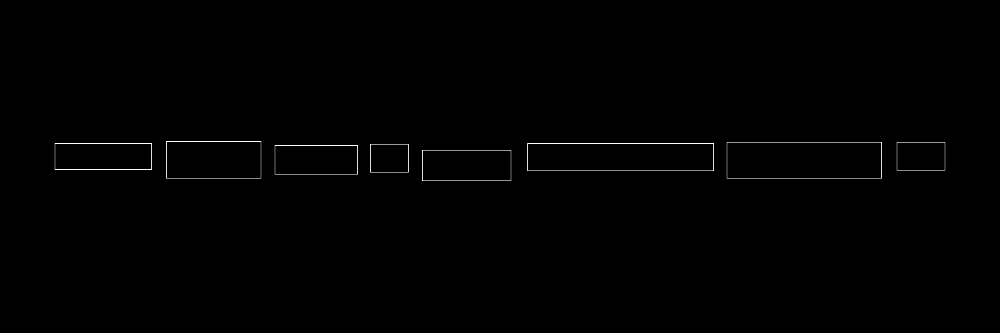

*******
Folding
*******

.. autoclass:: augraphy.augmentations.folding.Folding
    :members:
    :undoc-members:
    :show-inheritance:

--------
Overview
--------
The Folding augmentation emulates folded paper being scanned, with a visible warp effect around the fold line. For additional input such as mask and keypoints, they are fully supported. For bounding boxes, only the start point or end point of the box will be affected.

Initially, a clean image with single line of text is created.

Code example:

::

    # import libraries
    import cv2
    import numpy as np
    from augraphy import *

    # create a clean image with single line of text
    image = np.full((500, 1500,3), 250, dtype="uint8")
    cv2.putText(
        image,
        "Lorem ipsum dolor sit amet, consectetur adipiscing elit",
        (80, 250),
        cv2.FONT_HERSHEY_SIMPLEX,
        1.5,
        0,
        3,
    )

    cv2.imshow("Input image", image)

Clean image:

.. figure:: augmentations/input.png

---------
Example 1
---------
In this example, a Folding augmentation instance is initialized and the folding count is set to 10 (fold_count=10).
There will be no noise at the folding area (fold_noise=0.0) and the angle of folding is set to random value in between -360 to 360 degree (-360, 360).
Each folding gradient width is set to low value (0.2, 0.2) and folding gradient height is to very low value (0.02, 0.02).
The backdrop color on the folding effect is set to black color (0, 0, 0).

Code example:

::

    folding = Folding(fold_count=10,
                      fold_noise=0.0,
                      fold_angle_range = (-360,360),
                      gradient_width=(0.1, 0.2),
                      gradient_height=(0.01, 0.1),
                      backdrop_color = (0,0,0),
                      )

    img_folded= folding(image)
    cv2.imshow("folding", img_folded)

Augmented image:

.. figure:: augmentations/folding/folding.png

---------
Example 2
---------
In this example, a Folding augmentation will be applied to additional inputs such as mask, keypoints and bounding boxes.
The Folding augmentation will be using the default parameters value and hence no additional parameters value will be specified.

Code example:

::

    folding = Folding()

    img_folded, mask, keypoints, bounding_boxes = folding(image=image, mask=mask, keypoints=keypoints, bounding_boxes=bounding_boxes)
    cv2.imshow("folding", img_folded)

Input mask:

.. figure:: augmentations/input_mask.png

Input keypoints:

.. figure:: augmentations/input_keypoints.png

Input bounding boxes:

.. figure:: augmentations/input_bounding_boxes.png

Augmented image:

Augmented mask:

Augmented keypoints:

Augmented bounding boxes:

