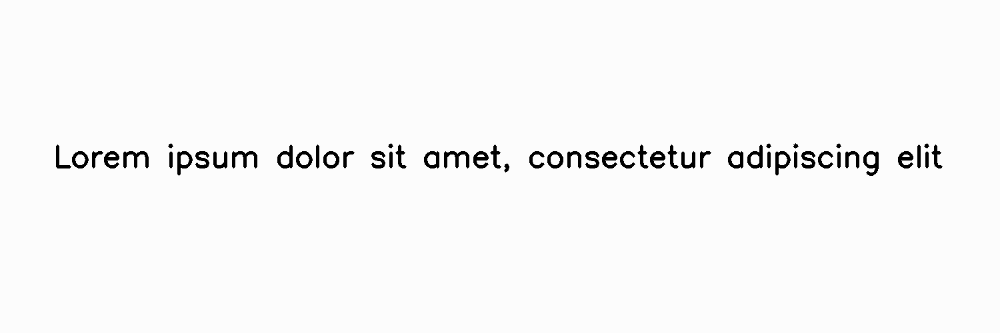

*****
Gamma
*****

.. autoclass:: augraphy.augmentations.gamma.Gamma
    :members:
    :undoc-members:
    :show-inheritance:

--------
Overview
--------
The Gamma augmentation randomly applies gamma correction (from a range of values) on the image but a gamma value of 1 will not affect the image.

Initially, a clean image with single line of text is created.

Code example:

::

    # import libraries
    import cv2
    import numpy as np
    from augraphy import *
    
    
    # create a clean image with single line of text
    image = np.full((500, 1500,3), 250, dtype="uint8")
    cv2.putText(
        image,
        "Lorem ipsum dolor sit amet, consectetur adipiscing elit",
        (80, 250),
        cv2.FONT_HERSHEY_SIMPLEX,
        1.5,
        0,
        3,
    )
    
    cv2.imshow("Input image", image)

Clean image:

.. figure:: augmentations/input.png

---------
Example 1
---------
In this example, a Gamma augmentation instance is initialized and the gamma range is set to random value between 2 to 3 times of existing gamma (2,3). 

Code example:

::

    gamma = Gamma(gamma_range=(2.0, 3.0))
    
    img_gamma= gamma(image)
    cv2.imshow("gamma", img_gamma)

Augmented image:

