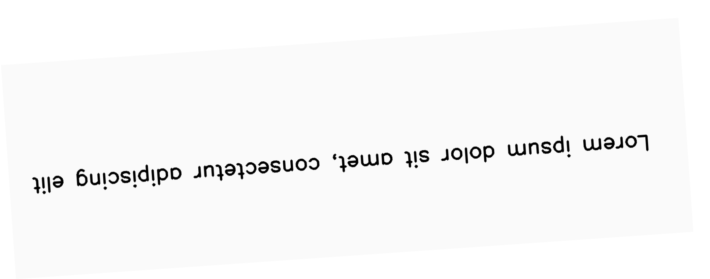

*********
Geometric
*********

.. autoclass:: augraphy.augmentations.geometric.Geometric
    :members:
    :undoc-members:
    :show-inheritance:

--------
Overview
--------
The geometric augmentation applies basic geometric transformations such as resizing, flips and rotation.

Initially, a clean image with single line of text is created.

Code example:

::

    # import libraries
    import cv2
    import numpy as np
    from augraphy import *
    
    
    # create a clean image with single line of text
    image = np.full((500, 1500,3), 250, dtype="uint8")
    cv2.putText(
        image,
        "Lorem ipsum dolor sit amet, consectetur adipiscing elit",
        (80, 250),
        cv2.FONT_HERSHEY_SIMPLEX,
        1.5,
        0,
        3,
    )
    
    cv2.imshow("Input image", image)

Clean image:

.. figure:: augmentations/input.png

---------
Example 1
---------
In this example, a Geometric augmentation instance is initialized and the image size is scaled randomly between 0.5 to 1.5 times (0.5, 1.5) of original size.
Horizontal translation is set to 50 pixels to the right and vertical translation is set to 50 pixels to the top of the image (50, -50).
Flags for both flip left right and flip up down is enabled. 
It is set to rotate randomly from 3 to 5 degree (3,5).

Code example:

::

    geometric = Geometric(scale=(0.5, 1.5),
                          translation=(50, -50),
                          fliplr=1,
                          flipud=1,
                          crop=(),
                          rotate_range=(3, 5)
                          )
    
    img_geometric_transform = geometric(image)
    cv2.imshow("geometric_transform", img_geometric_transform)

Augmented image:

