*********
Geometric
*********

.. autoclass:: augraphy.augmentations.geometric.Geometric
    :members:
    :undoc-members:
    :show-inheritance:

--------
Overview
--------
The geometric augmentation applies basic geometric transformations such as resizing, flips and rotation.

Initially, a clean image with single line of text is created.

Code example:

::

    # import libraries
    import cv2
    import numpy as np
    from augraphy import *

    # create a clean image with single line of text
    image = np.full((500, 1500,3), 250, dtype="uint8")
    cv2.putText(
        image,
        "Lorem ipsum dolor sit amet, consectetur adipiscing elit",
        (80, 250),
        cv2.FONT_HERSHEY_SIMPLEX,
        1.5,
        0,
        3,
    )

    cv2.imshow("Input image", image)

Clean image:

.. figure:: augmentations/input.png

---------
Example 1
---------
In this example, a Geometric augmentation instance is initialized and the image size is scaled randomly between 0.5 to 1.5 times (0.5, 1.5) of original size.
Horizontal translation is set to 50 pixels to the right and vertical translation is set to 50 pixels to the top of the image (50, -50).
Flags for both flip left right and flip up down is enabled.
It is set to rotate randomly from 3 to 5 degree (3,5).

Code example:

::

    geometric = Geometric(scale=(0.5, 1.5),
                          translation=(50, -50),
                          fliplr=1,
                          flipud=1,
                          crop=(),
                          rotate_range=(3, 5)
                          )

    img_geometric_transform = geometric(image)

    cv2.imshow("geometric_transform", img_geometric_transform)

Augmented image:

.. figure:: augmentations/geometric/geometric_transform.png

---------
Example 2
---------
In this example, a Geometric augmentation will be applied to additional inputs such as mask, keypoints and bounding boxes.
The scale of the augmentation is set to random value in between 1.5 and 2.0.

Code example:

::

    geometric = Geometric(scale=(1.5, 2.0))

    img_geometric_transform, mask, keypoints, bounding_boxes = geometric(image, mask, keypoints, bounding_boxes)

    cv2.imshow("geometric_transform", img_geometric_transform)

Input mask:

.. figure:: augmentations/input_mask.png

Input keypoints:

.. figure:: augmentations/input_keypoints.png

Input bounding boxes:

.. figure:: augmentations/input_bounding_boxes.png

Augmented image:

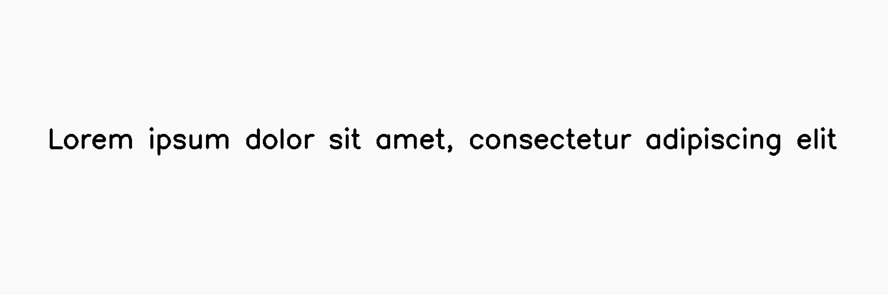

Augmented mask:

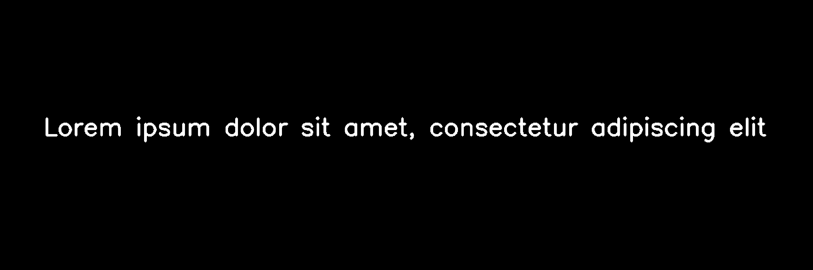

Augmented keypoints:

Augmented bounding boxes:

.. figure:: augmentations/geometric/geometric_transform2_bounding_boxes.png

---------
Example 3
---------
In this example, a Geometric augmentation will be applied to additional inputs such as mask, keypoints and bounding boxes.
The translation of the augmentation is set to translate 100 pixels to the right and 100 pixels to the top section of the image.

Code example:

::

    geometric = Geometric(translation=(100, -100))

    img_geometric_transform, mask, keypoints, bounding_boxes = geometric(image, mask, keypoints, bounding_boxes)

    cv2.imshow("geometric_transform", img_geometric_transform)

Augmented image:

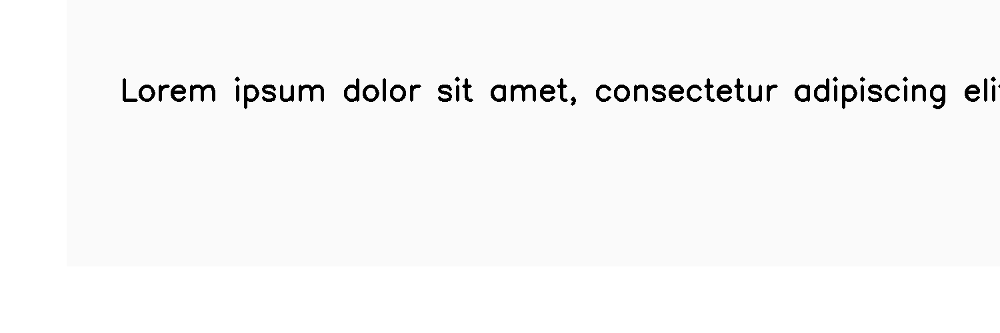

Augmented mask:

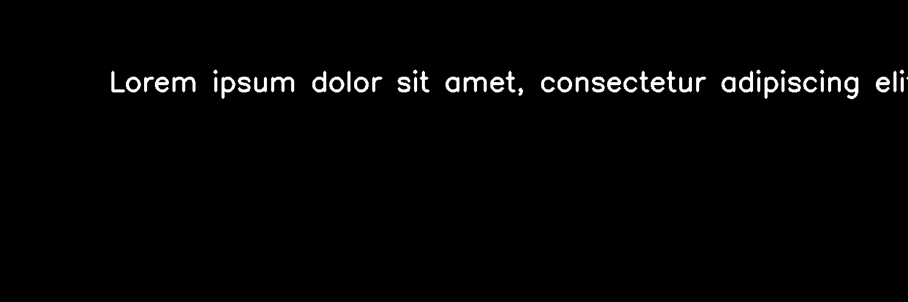

Augmented keypoints:

Augmented bounding boxes:

---------
Example 4
---------
In this example, a Geometric augmentation will be applied to additional inputs such as mask, keypoints and bounding boxes.
The augmentation is set to flip image in left-right and up-down direction.

Code example:

::

    geometric = Geometric(fliplr=1, flipud=1)

    img_geometric_transform, mask, keypoints, bounding_boxes = geometric(image, mask, keypoints, bounding_boxes)

    cv2.imshow("geometric_transform", img_geometric_transform)

Augmented image:

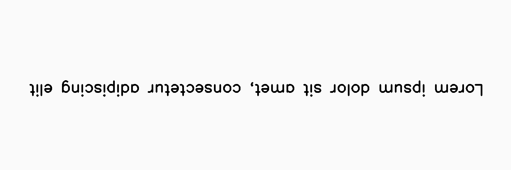

Augmented mask:

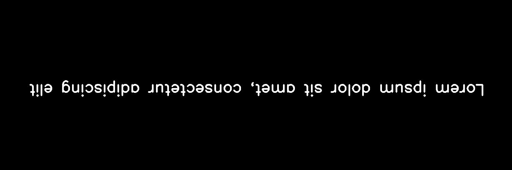

Augmented keypoints:

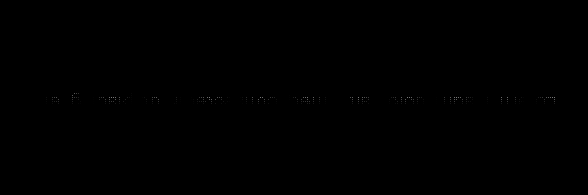

Augmented bounding boxes:

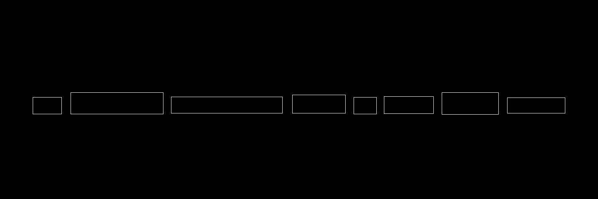

---------
Example 5
---------
In this example, a Geometric augmentation will be applied to additional inputs such as mask, keypoints and bounding boxes.
The augmentation is set to crop 60% of image, removing 20% of all image edges.

Code example:

::

    geometric = Geometric(crop=(0.2, 0.2, 0.8, 0.8))

    img_geometric_transform, mask, keypoints, bounding_boxes = geometric(image, mask, keypoints, bounding_boxes)

    cv2.imshow("geometric_transform", img_geometric_transform)

Augmented image:

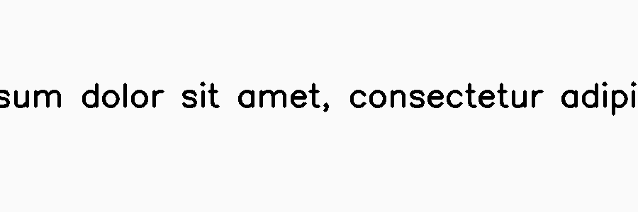

Augmented mask:

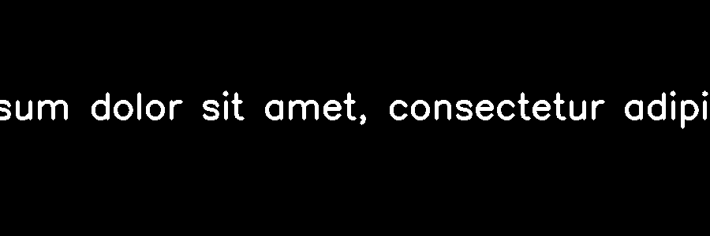

Augmented keypoints:

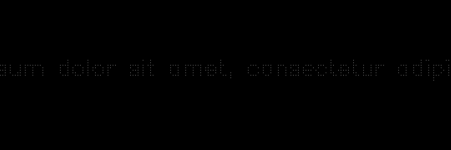

Augmented bounding boxes:

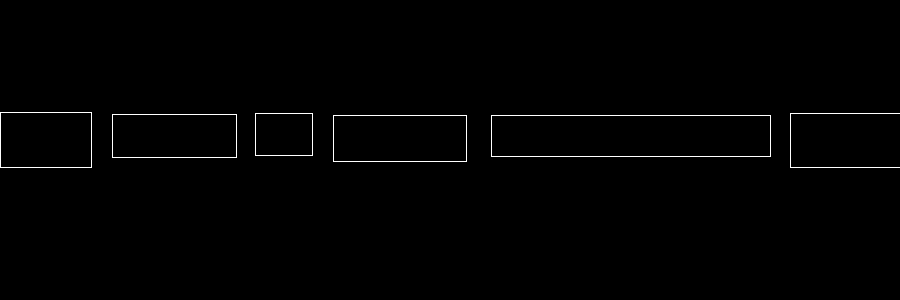

---------
Example 6
---------
In this example, a Geometric augmentation will be applied to additional inputs such as mask, keypoints and bounding boxes.
The augmentation is set to rotate image randomly between -60 degree and 60 degree.

Code example:

::

    geometric = Geometric(rotate_range=(-60,60))

    img_geometric_transform, mask, keypoints, bounding_boxes = geometric(image, mask, keypoints, bounding_boxes)

    cv2.imshow("geometric_transform", img_geometric_transform)

Augmented image:

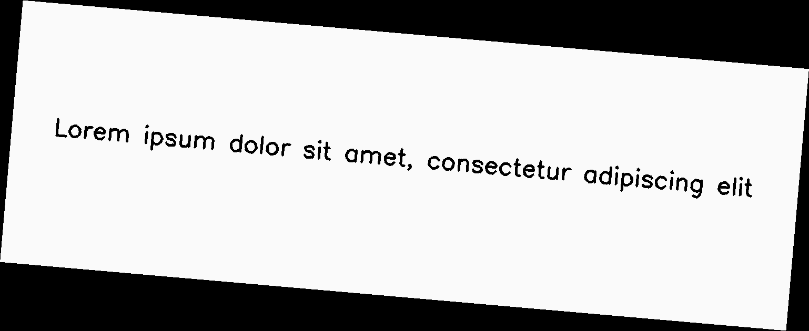

Augmented mask:

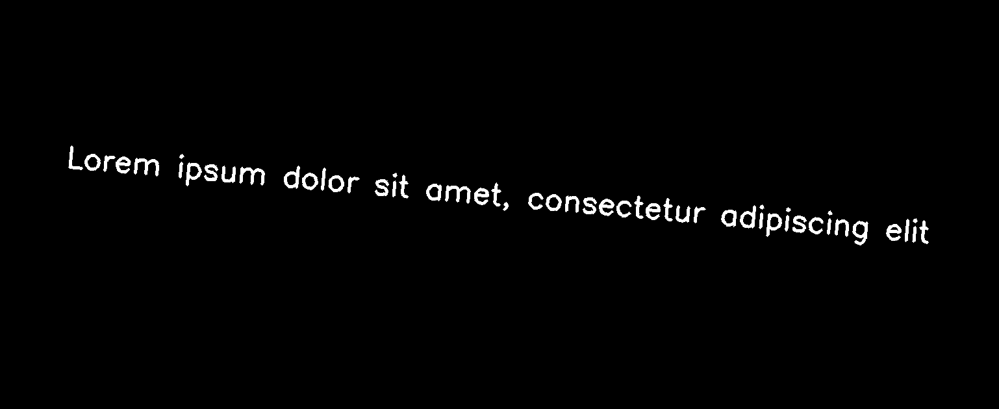

Augmented keypoints:

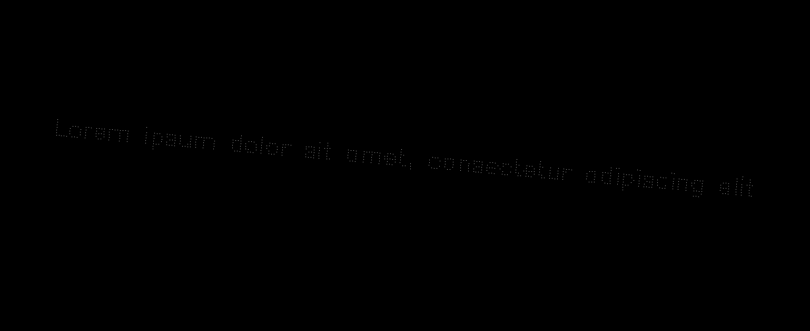

Augmented bounding boxes:

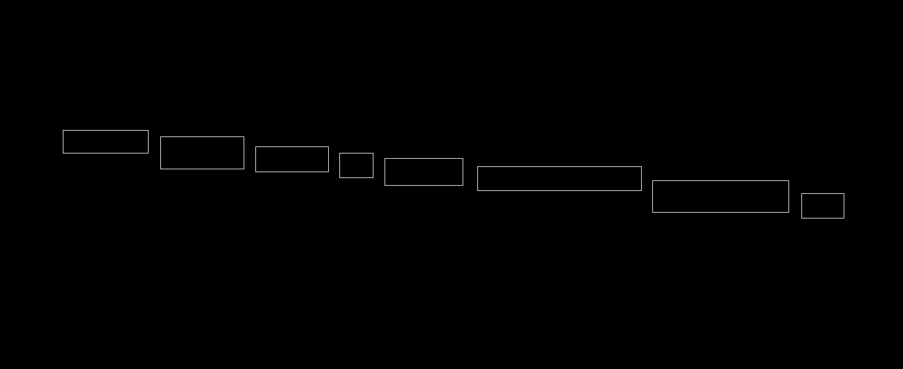

---------
Example 7
---------
In this example, a Geometric augmentation will be applied to additional inputs such as mask, keypoints and bounding boxes.
The augmentation is set to pad image in all edges by 10%.

Code example:

::

    geometric = Geometric(padding=[0.1,0.1,0.1,0.1])

    img_geometric_transform, mask, keypoints, bounding_boxes = geometric(image, mask, keypoints, bounding_boxes)

    cv2.imshow("geometric_transform", img_geometric_transform)

Augmented image:

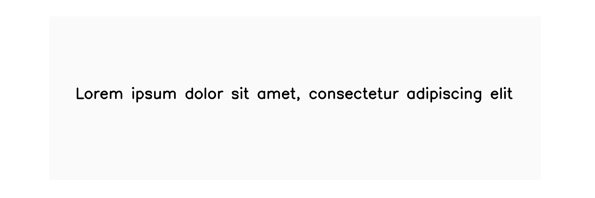

Augmented mask:

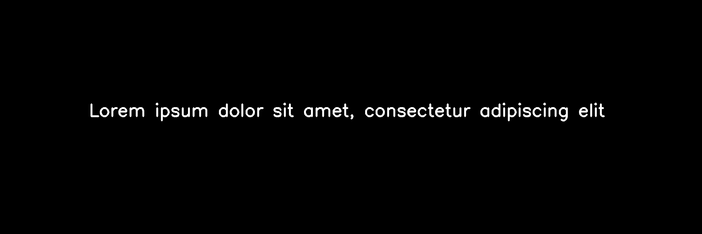

Augmented keypoints:

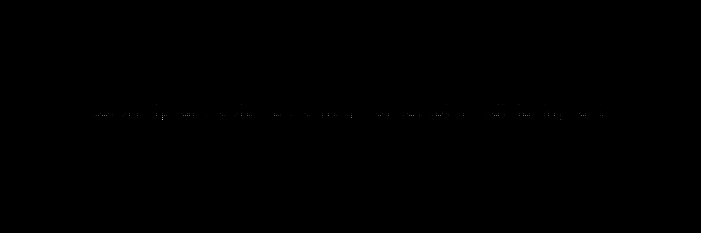

Augmented bounding boxes:

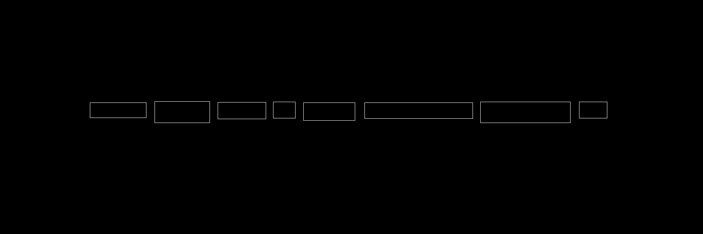
