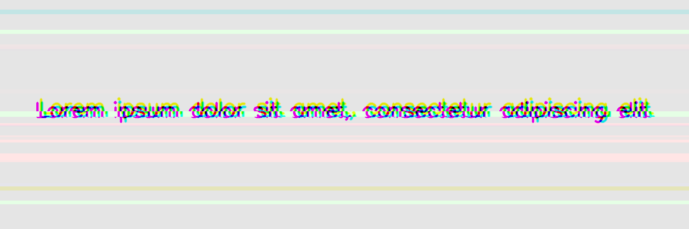
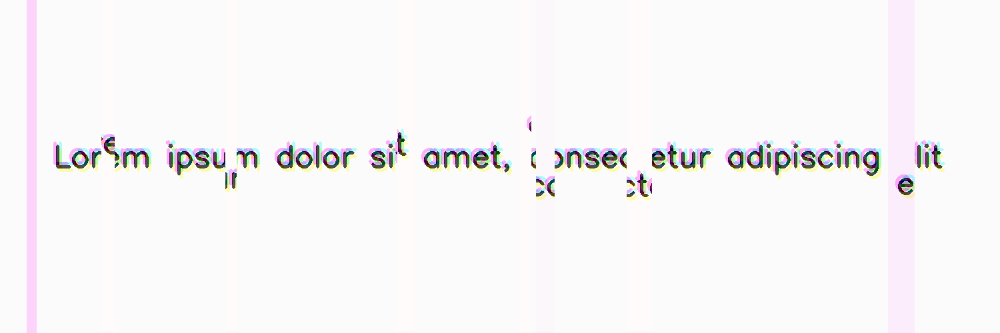
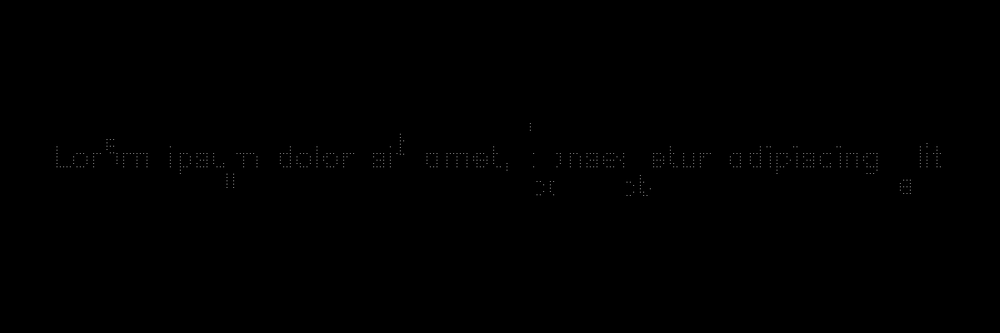
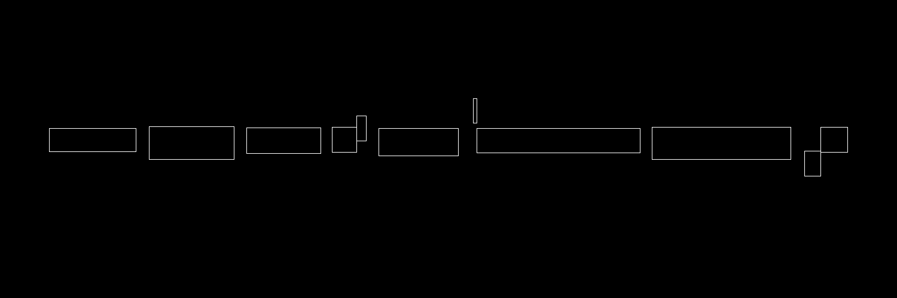

************
GlitchEffect
************

.. autoclass:: augraphy.augmentations.glitcheffect.GlitchEffect
    :members:
    :undoc-members:
    :show-inheritance:

--------
Overview
--------
The GlitchEffect augmentation create glitch effect by applying ColorShift and shifts patches of image horizontally or vertically. For additional input such as mask and keypoints, they are fully supported. For bounding boxes, additional boxes might be created on the shifted area. Size of some existing boxes might be pruned on the shifted area too.

Initially, a clean image with single line of text is created.

Code example:

::

    # import libraries
    import cv2
    import numpy as np
    from augraphy import *

    # create a clean image with single line of text
    image = np.full((500, 1500,3), 250, dtype="uint8")
    cv2.putText(
        image,
        "Lorem ipsum dolor sit amet, consectetur adipiscing elit",
        (80, 250),
        cv2.FONT_HERSHEY_SIMPLEX,
        1.5,
        0,
        3,
    )

    cv2.imshow("Input image", image)

Clean image:

.. figure:: augmentations/input.png

---------
Example 1
---------
In this example, a GlitchEffect augmentation instance is initialized and glitch direction is set to horizontal ("horizontal").
The number of glitch effect is set to any random number between 8 and 16 (8,16).
The glitch size is set to random value in between 5 and 50 pixels (5, 50).
The glitch offset is set of random value in between 5 and 10 pixels (5, 10).

Code example:

::

    glitcheffect= GlitchEffect(glitch_direction = "horizontal",
                               glitch_number_range = (8, 16),
                               glitch_size_range = (5, 50),
                               glitch_offset_range = (5, 10)
                               )

    img_glitcheffect = glitcheffect(image)

    cv2.imshow("glitcheffect, img_glitcheffect)

Augmented image:

---------
Example 2
---------
In this example, a GlitchEffect augmentation will be applied to additional inputs such as mask, keypoints and bounding boxes.
The GlitchEffect augmentation will be using the default parameters value and hence no additional parameters value will be specified.

Code example:

::

    glitcheffect= GlitchEffect()

    img_glitcheffect, mask, keypoints, bounding_boxes = glitcheffect(image=image, mask=mask, keypoints=keypoints, bounding_boxes=bounding_boxes)

    cv2.imshow("glitcheffect, img_glitcheffect)

Input mask:

.. figure:: augmentations/input_mask.png

Input keypoints:

.. figure:: augmentations/input_keypoints.png

Input bounding boxes:

.. figure:: augmentations/input_bounding_boxes.png

Augmented image:

Augmented mask:

Augmented keypoints:

Augmented bounding boxes:

