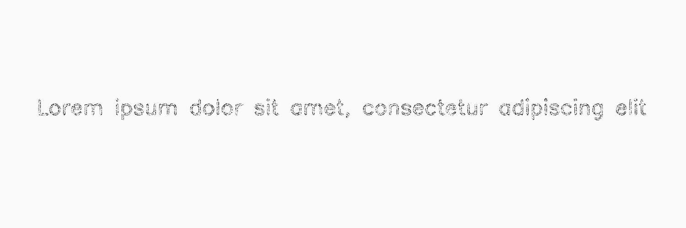

*******
Hollow
*******

.. autoclass:: augraphy.augmentations.hollow.Hollow
    :members:
    :undoc-members:
    :show-inheritance:

--------
Overview
--------
The Hollow augmentation creates hollow effect by replacing detected contours with edges.
The detected contours are removed by using median filter operation.

Initially, a clean image with single line of text is created.

Code example:

::

    # import libraries
    import cv2
    import numpy as np
    from augraphy import *

    # create a clean image with single line of text
    image = np.full((500, 1500,3), 250, dtype="uint8")
    cv2.putText(
        image,
        "Lorem ipsum dolor sit amet, consectetur adipiscing elit",
        (80, 250),
        cv2.FONT_HERSHEY_SIMPLEX,
        1.5,
        0,
        3,
    )

    cv2.imshow("Input image", image)

Clean image:

.. figure:: augmentations/input.png

---------
Example 1
---------
In this example, a Hollow augmentation instance is initialized.
The median kernel value is set to 101 (101,101) so that it can remove moderate size contours.
The min and max width of the contours are 1 (1,1) and 200 (200,200) respectiely.
The min and max height of the contours are 1 (1,1) and 200 (200,200) respectiely.
The min and max area of the contours are 10 (10,10) and 5000 (5000,5000) respectiely.
The dilation kernel value is 3 (3,3) so tha thickhen the generated hollow effect.

Code example:

::

    hollow = Hollow(hollow_median_kernel_value_range = (101, 101),
                    hollow_min_width_range=(1, 1),
                    hollow_max_width_range=(200, 200),
                    hollow_min_height_range=(1, 1),
                    hollow_max_height_range=(200, 200),
                    hollow_min_area_range=(10, 10),
                    hollow_max_area_range=(5000, 5000),
                    hollow_dilation_kernel_size_range = (3, 3),
                    )

    img_hollow= hollow(image)
    cv2.imshow("hollow", img_hollow)

Augmented image:

