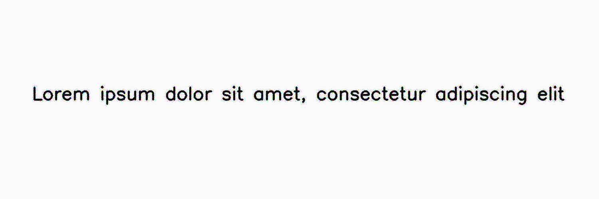

********
InkBleed
********

.. autoclass:: augraphy.augmentations.inkbleed.InkBleed
    :members:
    :undoc-members:
    :show-inheritance:

--------
Overview
--------
The InkBleed augmentation relies on Sobel edge detection to create a mask of all edges, then applies random noise to those edges. When followed by a blur, this creates a fuzzy edge that emulates an ink bleed effect.

Initially, a clean image with single line of text is created.

Code example:

::

    # import libraries
    import cv2
    import numpy as np
    from augraphy import *

    # create a clean image with single line of text
    image = np.full((500, 1500,3), 250, dtype="uint8")
    cv2.putText(
        image,
        "Lorem ipsum dolor sit amet, consectetur adipiscing elit",
        (80, 250),
        cv2.FONT_HERSHEY_SIMPLEX,
        1.5,
        0,
        3,
    )

    cv2.imshow("Input image", image)

Clean image:

.. figure:: augmentations/input.png

---------
Example 1
---------
In this example, a InkBleed augmentation instance is initialized and the range of intensity is set to a range of moderate value (0.4, 0.7).
The kernel size is set to 5x5 (5,5) to get a moderate spreadness of the effect.
The severity of the ink bleed effect is set to a random low value in between 0.2 and 0.4 (0.2, 0.4).

Code example:

::

    inkbleed = InkBleed(intensity_range=(0.4, 0.7),
                        kernel_size=(5, 5),
                        severity=(0.2, 0.4)
                        )

    img_inkbleed = inkbleed(image)
    cv2.imshow("inkbleed", img_inkbleed)

Augmented image:

