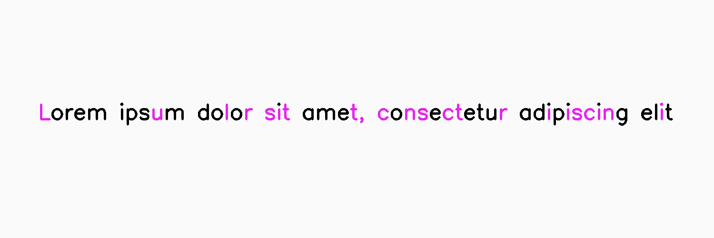

************
InkColorSwap
************

.. autoclass:: augraphy.augmentations.inkcolorswap.InkColorSwap
    :members:
    :undoc-members:
    :show-inheritance:

--------
Overview
--------
The InkColorSwap augmentation swaps color of ink in the image based on detected ink contours.

Initially, a clean image with single line of text is created.

Code example:

::

    # import libraries
    import cv2
    import numpy as np
    from augraphy import *

    # create a clean image with single line of text
    image = np.full((500, 1500,3), 250, dtype="uint8")
    cv2.putText(
        image,
        "Lorem ipsum dolor sit amet, consectetur adipiscing elit",
        (80, 250),
        cv2.FONT_HERSHEY_SIMPLEX,
        1.5,
        0,
        3,
    )

    cv2.imshow("Input image", image)

Clean image:

.. figure:: augmentations/input.png

---------
Example 1
---------
In this example, a InkColorSwap augmentation instance is initialized and the swapping color is set to random ("random").
The continuous swapping count is set to random number in between 1 and 10 (1,10).
The minimum contour width is set to 3 (3,3) and the maximum contour width is set to 100 (100,100).
The minimum contour height is set to 3 (3,3) and the maximum contour height is set to 100 (100,100).
The minimum contour area is set to 10 (10,10) and the maximum contour area is set to 400 (400,400).

Code example:

::

    inkcolorswap= InkColorSwap(ink_swap_color = "random",
                               ink_swap_sequence_number_range = (1,10),
                               ink_swap_min_width_range=(3,3),
                               ink_swap_max_width_range=(100,100),
                               ink_swap_min_height_range=(3,3),
                               ink_swap_max_height_range=(100,100),
                               ink_swap_min_area_range=(10,10),
                               ink_swap_max_area_range=(400,400)
                               )

    img_inkcolorswap = inkcolorswap(image)

    cv2.imshow("inkcolorswap", img_inkcolorswap)

Augmented image:

