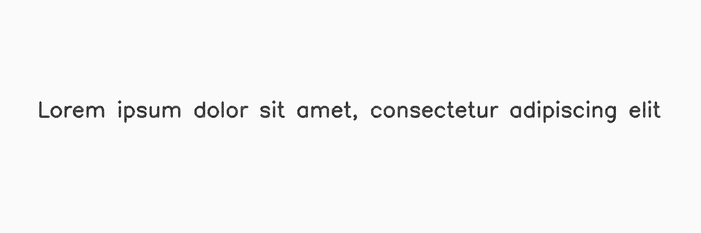

***********
InkMottling
***********

.. autoclass:: augraphy.augmentations.inkmottling.InkMottling
    :members:
    :undoc-members:
    :show-inheritance:

--------
Overview
--------
The InkMottling augmentation create a random pattern effect in the detected ink by blending a layer of random Gaussian noise.

Initially, a clean image with single line of text is created.

Code example:

::

    # import libraries
    import cv2
    import numpy as np
    from augraphy import *

    # create a clean image with single line of text
    image = np.full((500, 1500,3), 250, dtype="uint8")
    cv2.putText(
        image,
        "Lorem ipsum dolor sit amet, consectetur adipiscing elit",
        (80, 250),
        cv2.FONT_HERSHEY_SIMPLEX,
        1.5,
        0,
        3,
    )

    cv2.imshow("Input image", image)

Clean image:

.. figure:: augmentations/input.png

---------
Example 1
---------
In this example, a InkMottling augmentation instance is initialized and the alpha value of the ink mottling effect is set to 0.5 (0.5, 0.5).
The generated scale of Gaussian noise pattern is set to 1 (1,1).
The Gaussian kernel size is set to random number between 3 and 5 (3,5).

Code example:

::

    inkmottling= InkMottling(ink_mottling_alpha_range=(0.5, 0.5),
                             ink_mottling_noise_scale_range=(1,1),
                             ink_mottling_gaussian_kernel_range=(3,5),
                             )

    img_inkmottling = inkmottling(image)

    cv2.imshow("inkmottling", img_inkmottling)

Augmented image:

