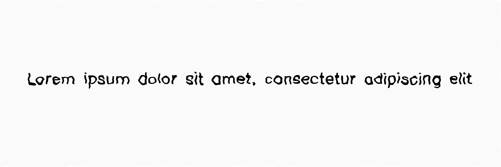
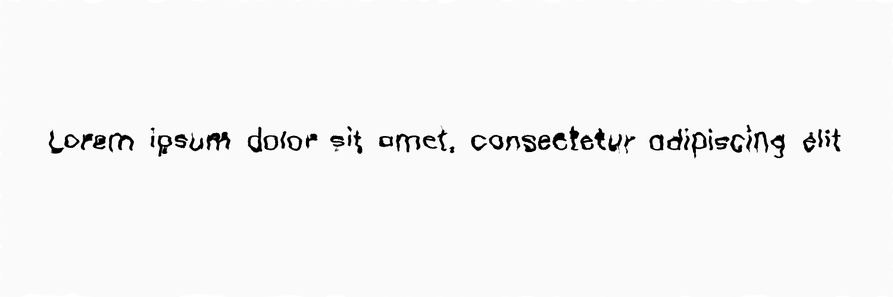

**********
InkShifter
**********

.. autoclass:: augraphy.augmentations.inkshifter.InkShifter
    :members:
    :undoc-members:
    :show-inheritance:

--------
Overview
--------
The Inkshifter Augmentation applies a noise map on the image and displaces the text on the image

Code example:

::

    # import libraries
    import cv2
    import numpy as np
    from augraphy import *

    # create a clean image with single line of text
    image = np.full((500, 1500,3), 250, dtype="uint8")
    cv2.putText(
        image,
        "Lorem ipsum dolor sit amet, consectetur adipiscing elit",
        (80, 250),
        cv2.FONT_HERSHEY_SIMPLEX,
        1.5,
        0,
        3,
    )

    cv2.imshow("Input image", image)

Clean image:

.. figure:: augmentations/input.png

---------
Example 1
---------

In this example, we demonstrate the usage of the InkShifter augmentation.
This augmentation specializes in producing the "text jittering" effect by
introducing various noise patterns.
By default, the augmentation employs the "random" noise type, offering a diverse
selection of noise options. The text shift scale range is typically set between
18 and 27, determining the magnitude of the shifting effect. Additionally, the
text shift factor range specifies the range of factors by which the text can be
shifted, typically varying from 1 to 4. The text fade range, by default, spans
from 0 to 2, allowing for fading effects. The InkShifter augmentation provides
two noise functions for image pixel distortion: Perlin Noise and Fractal Noise.
Perlin Noise, offering image distortion through a Perlin Noise Map, is the
default option for producing the desired effect. By following the documentation,
users can effectively utilize the InkShifter augmentation to introduce text
jittering effects with customizable noise options and parameters.

By modifying the text_shift_scale_range and text_shift_factor_range parameters,
we can control the level of text distortion in the augmentation. Adjusting the
text_shift_scale_range allows us to change the extent of the text's left and
right movement, while modifying the text_shift_factor_range enables us to
manipulate the text's vertical and horizontal displacement. In this way, we
have the flexibility to customize the amount and direction of the text's
movement according to our desired effect.

Inspiration Repository : https://github.com/sherlockdoyle/Handwriter/tree/main

Code example:

::

    inkshifter_obj = InkShifter(
        text_shift_scale_range=(18, 27),
        text_shift_factor_range=(1, 4),
        text_fade_range=(0, 2),
	    noise_type = "random",
    )

    inkshifter_img = inkshifter_obj(image)
    cv2.imshow("Inkshifter Augmentation", inkshifter_img)

Augmented image:

