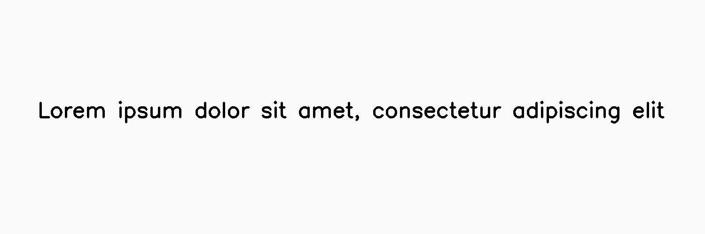

****
Jpeg
****

.. autoclass:: augraphy.augmentations.jpeg.Jpeg
    :members:
    :undoc-members:
    :show-inheritance:

--------
Overview
--------
The Jpeg augmentation Uses JPEG encoding to create JPEG compression artifacts in the image.

Initially, a clean image with single line of text is created.

Code example:

::

    # import libraries
    import cv2
    import numpy as np
    from augraphy import *
    
    
    # create a clean image with single line of text
    image = np.full((500, 1500,3), 250, dtype="uint8")
    cv2.putText(
        image,
        "Lorem ipsum dolor sit amet, consectetur adipiscing elit",
        (80, 250),
        cv2.FONT_HERSHEY_SIMPLEX,
        1.5,
        0,
        3,
    )
    
    cv2.imshow("Input image", image)

Clean image:

.. figure:: augmentations/input.png

---------
Example 1
---------
In this example, a Jpeg augmentation instance is initialized and the quality is set to range of 5 to 10% (5,10) of original image quality.

Code example:

::

    jpeg_5 = Jpeg(quality_range=(5, 10))
    
    img_jpeg_5 = jpeg_5(image)
    cv2.imshow("jpeg_5", img_jpeg_5)

Augmented image:

---------
Example 2
---------
In this example, a Jpeg augmentation instance is initialized and the quality is set to range of 50 to 55% (90,95) of original image quality.

Code example:

::

    jpeg_50 = Jpeg(quality_range=(50, 55))
    
    img_jpeg_50 = jpeg_50(image)
    cv2.imshow("jpeg_50", img_jpeg_50)

Augmented image:

