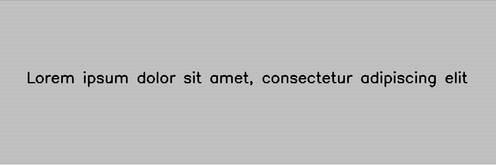

****************
LCDScreenPattern
****************

.. autoclass:: augraphy.augmentations.lcdscreenpattern.LCDScreenPattern
    :members:
    :undoc-members:
    :show-inheritance:

--------
Overview
--------
The LCDScreenPattern augmentation creates a LCD Screen Pattern effect by overlaying different line patterns into image.

Initially, a clean image with single line of text is created.

Code example:

::

    # import libraries
    import cv2
    import numpy as np
    from augraphy import *

    # create a clean image with single line of text
    image = np.full((500, 1500,3), 250, dtype="uint8")
    cv2.putText(
        image,
        "Lorem ipsum dolor sit amet, consectetur adipiscing elit",
        (80, 250),
        cv2.FONT_HERSHEY_SIMPLEX,
        1.5,
        0,
        3,
    )

    cv2.imshow("Input image", image)

Clean image:

.. figure:: augmentations/input.png

---------
Example 1
---------
In this example, a LCDScreenPattern augmentation instance is initialized and the pattern type is set to horizontal lines pattern (pattern_type="Horizontal"). 
The value of pattern is set to random value in between 0 and 16 (0,16).
The distance between each line pattern is set to random value in between 3 and 5 pixels (3,5).
The method to overlay pattern into input image is set to use "darken" method.

Code example:

::

    lcdscreenpattern = LCDScreenPattern(pattern_type="Horizontal",
                                        pattern_value_range = (0,16),
                                        pattern_skip_distance_range = (3,5), 
                                        pattern_overlay_method = "darken",
                                        )

    img_lcdscreenpattern = lcdscreenpattern(image)
    cv2.imshow("lcdscreenpattern", img_lcdscreenpattern)

Augmented image:

