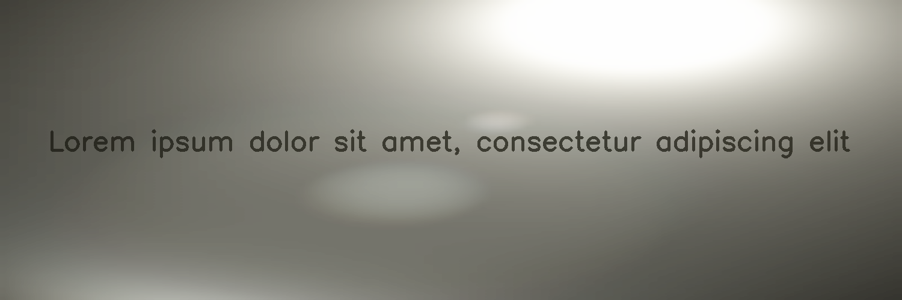

*********
LensFlare
*********

.. autoclass:: augraphy.augmentations.lensflare.LensFlare
    :members:
    :undoc-members:
    :show-inheritance:

--------
Overview
--------
The LensFlare augmentation creates a lens flare effect by drawing a bright spot light with darker background.

Initially, a clean image with single line of text is created.

Code example:

::

    # import libraries
    import cv2
    import numpy as np
    from augraphy import *

    # create a clean image with single line of text
    image = np.full((500, 1500,3), 250, dtype="uint8")
    cv2.putText(
        image,
        "Lorem ipsum dolor sit amet, consectetur adipiscing elit",
        (80, 250),
        cv2.FONT_HERSHEY_SIMPLEX,
        1.5,
        0,
        3,
    )

    cv2.imshow("Input image", image)

Clean image:

.. figure:: augmentations/input.png

---------
Example 1
---------
In this example, a LensFlare augmentation instance is initialized and location of the lens flare effect is set to random. The color of the effect is set to random too. For the size of spot light in lens flare effect, it is set to random value in between 0.5 and 5 (0.5, 5).

Code example:

::

    lensflare = LensFlare(lens_flare_location = "random",
        		  lens_flare_color = "random",
        		  lens_flare_size = (0.5, 5),
			  )

    img_lensflare = lensflare(image)
    cv2.imshow("lensflare", img_lensflare)

Augmented image:

