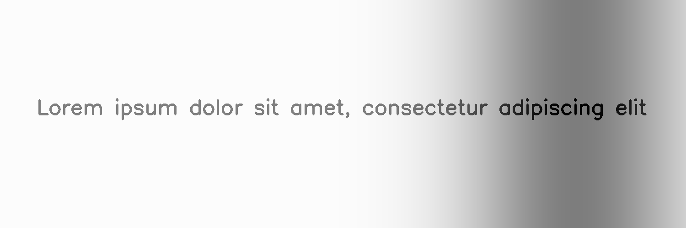
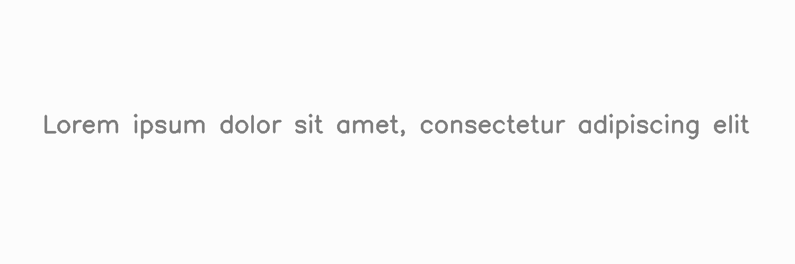

****************
LightingGradient
****************

.. autoclass:: augraphy.augmentations.lightinggradient.LightingGradient
    :members:
    :undoc-members:
    :show-inheritance:

--------
Overview
--------
The Lighting Gradient augmentation produces a decayed light mask generated by a light strip given position and direction, and applies it to the image as a lighting or brightness gradient.

Initially, a clean image with single line of text is created.

Code example:

::

    # import libraries
    import cv2
    import numpy as np
    from augraphy import *
    
    
    # create a clean image with single line of text
    image = np.full((500, 1500,3), 250, dtype="uint8")
    cv2.putText(
        image,
        "Lorem ipsum dolor sit amet, consectetur adipiscing elit",
        (80, 250),
        cv2.FONT_HERSHEY_SIMPLEX,
        1.5,
        0,
        3,
    )
    
    cv2.imshow("Input image", image)

Clean image:

.. figure:: augmentations/input.png

---------
Example 1
---------
In this example, a LightingGradient augmentation instance is initialized and lighting position is set to random (None).
The lighting direction is set to 90 degree (90) and the lighting mode is set to Gausian method. 
The lighting transparency is set 50 precent (0.5).

Code example:

::

    lighting_gradient_gaussian = LightingGradient(light_position=None,
                                                  direction=90,
                                                  max_brightness=255,
                                                  min_brightness=0,
                                                  mode="gaussian",
                                                  transparency=0.5
                                                  )
    
    img_lighting_gradient_gaussian = lighting_gradient_gaussian(image)
    cv2.imshow("lighting_gradient_gaussian", img_lighting_gradient_gaussian)

Augmented image:

---------
Example 2
---------
In this example, a LightingGradient augmentation instance is initialized and lighting position is set to random (None).
The lighting direction is set to 45 degree (45) and the lighting mode is set to linear static method. 
The linear decay rate is set to 0.5 (0.5) and lighting transparency is set 50 precent (0.5).

Code example:

::

    lighting_gradient_linear_static = LightingGradient(light_position=None,
                                                  direction=45,
                                                  max_brightness=255,
                                                  min_brightness=0,
                                                  mode="linear_static",
                                                  linear_decay_rate = 0.5,
                                                  transparency=0.5
                                                  )
    
    img_lighting_gradient_linear_static= lighting_gradient_linear_static(image)
    cv2.imshow("lighting_gradient_linear_static", img_lighting_gradient_linear_static)

Augmented image:

