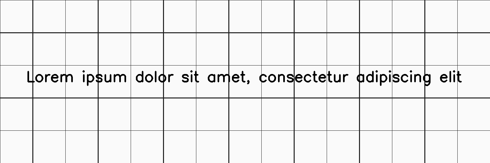
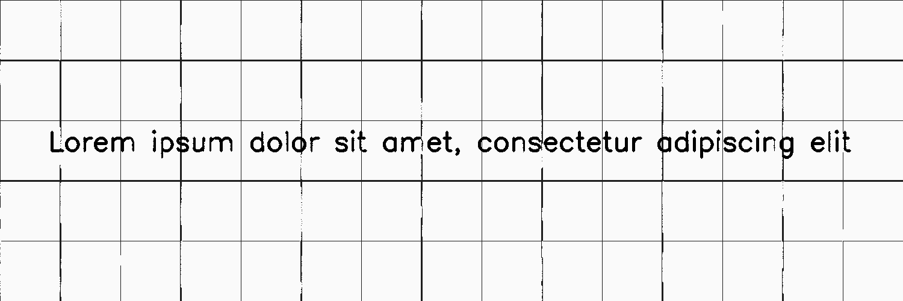

****************
LinesDegradation
****************

.. autoclass:: augraphy.augmentations.linesdegradation.LinesDegradation
    :members:
    :undoc-members:
    :show-inheritance:

--------
Overview
--------
The LinesDegradation degrades lines by replacing lines formed by image gradients with a different value.

Initially, a clean image with single line of text and multiple lines is created.

Code example:

::

    # import libraries
    import cv2
    import numpy as np
    from augraphy import *

    # create a clean image with single line of text
    image = np.full((500, 1500,3), 250, dtype="uint8")

    # add lines
    for i in range(15):
        cv2.line(image, (i*100,0), (i*100, 500), (30,30,30), 2**(i%2))
    for i in range(5):
        cv2.line(image, (0,i*100), (1500, i*100), (30,30,30), 2**(i%2))

    cv2.putText(
        image,
        "Lorem ipsum dolor sit amet, consectetur adipiscing elit",
        (80, 250),
        cv2.FONT_HERSHEY_SIMPLEX,
        1.5,
        0,
        3,
    )

    cv2.imshow("Input image", image)

Clean image:

---------
Example 1
---------
In this example, a LinesDegradation augmentation instance is initialized and the line_gradient_direction is set to (1,1) so that it affects only the vertical line.
The line_replacement_value is set to high value (250, 250) so that it creates a lines thinning effect.

Code example:

::

    lines_degradation = LinesDegradation(line_roi = (0.0, 0.0, 1.0, 1.0),
                                  	 line_gradient_range=(32, 255),
                            		 line_gradient_direction= (1,1),
                            		 line_split_probability=(0.2, 0.3),
                            		 line_replacement_value=(250, 250),
                            		 line_min_length=(15, 15),
                            		 line_long_to_short_ratio = (3,3),
                            		 line_replacement_probability = (0.5, 0.5),
                            		 line_replacement_thickness = (1, 2)
                            		 )

    img_lines_degradation = lines_degradation(image)
    cv2.imshow("Vertical degraded lines - Thinning", img_lines_degradation)

Augmented image:

---------
Example 2
---------
In this example, a LinesDegradation augmentation instance is initialized and the line_roi (region of interest) is set at the left side of the image (0.0, 0.0, 0.5, 1.0).
The line_replacement_value is set to low value (0, 25) so that it creates a lines thickening effect.

Code example:

::

    lines_degradation = LinesDegradation(line_roi = (0.0, 0.0, 0.5, 1.0),
                            		 line_gradient_range=(32, 255),
                           		 line_gradient_direction= (2,2),
                            		 line_split_probability=(0.2, 0.3),
                            		 line_replacement_value=(0, 25),
                            		 line_min_length=(15, 15),
                            		 line_long_to_short_ratio = (3,3),
                            		 line_replacement_probability = (1.0, 1.0),
                            		 line_replacement_thickness = (2, 2)
                            		 )

    img_lines_degradation = lines_degradation(image)
    cv2.imshow("Degraded lines in ROI - Thickening", img_lines_degradation)

Augmented image:

.. figure:: augmentations/linesdegradation/linesdegradation_thickening.png
