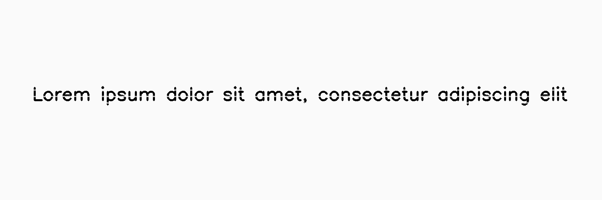
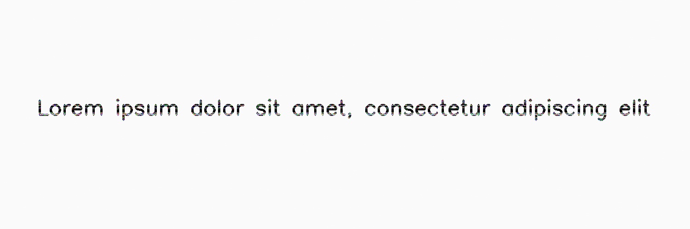

*******************
LowInkPeriodicLines
*******************

.. autoclass:: augraphy.augmentations.lowinkperiodiclines.LowInkPeriodicLines
    :members:
    :undoc-members:
    :show-inheritance:

--------
Overview
--------
`LowInkPeriodicLines` inherits from `LowInkLine`. LowInkPeriodicLines creates a set of lines that repeat in a periodic fashion throughout the image.

Initially, a clean image with single line of text is created.

Code example:

::

    # import libraries
    import cv2
    import numpy as np
    from augraphy import *

    # create a clean image with single line of text
    image = np.full((500, 1500,3), 250, dtype="uint8")
    cv2.putText(
        image,
        "Lorem ipsum dolor sit amet, consectetur adipiscing elit",
        (80, 250),
        cv2.FONT_HERSHEY_SIMPLEX,
        1.5,
        0,
        3,
    )

    cv2.imshow("Input image", image)

Clean image:

.. figure:: augmentations/input.png

---------
Example 1
---------
In this example, a LowInkPeriodicLines augmentation instance is initialized and lines count is set to random value in between 2 and 5 (2, 5).
The range of period is set to 30 (30, 30) and it is set to use consistent lines (True).
The noise probability is set to low value (0.1).

Code example:

::

    low_ink_periodic_line_consistent =  LowInkPeriodicLines(count_range=(2, 5),
                                                            period_range=(30, 30),
                                                            use_consistent_lines=True,
                                                            noise_probability=0.1,
                                                            )

    img_low_ink_periodic_line_consistent = low_ink_periodic_line_consistent(image)
    cv2.imshow("low_ink_periodic_line_consistent", img_low_ink_periodic_line_consistent)

Augmented image:

---------
Example 2
---------
In this example, a LowInkPeriodicLines augmentation instance is initialized and lines count is set to random value in between 2 and 5 (2, 5).
The range of period is set in between 10 and 30 (10, 30) and it is set to use non-consistent lines (False).
The noise probability is set to low value (0.1).

Code example:

::

    low_ink_periodic_line_non_consistent =  LowInkPeriodicLines(count_range=(2, 5),
                                                            period_range=(10, 30),
                                                            use_consistent_lines=False,
                                                            noise_probability=0.1,
                                                            )

    img_low_ink_periodic_line_non_consistent = low_ink_periodic_line_non_consistent(image)
    cv2.imshow("low_ink_periodic_line_non_consistent", img_low_ink_periodic_line_non_consistent)

Augmented image:

