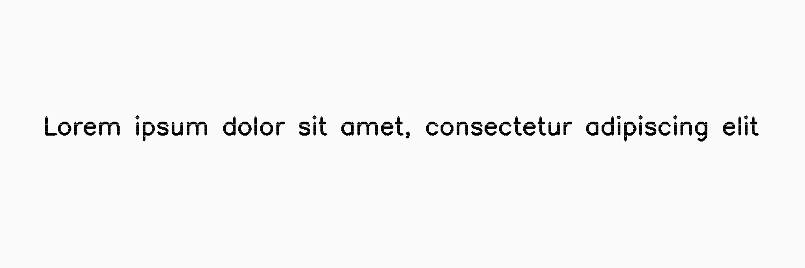

*****************
LowInkRandomLines
*****************

.. autoclass:: augraphy.augmentations.lowinkrandomlines.LowInkRandomLines
    :members:
    :undoc-members:
    :show-inheritance:

--------
Overview
--------
`LowInkRandomLines` inherits from `LowInkLine`. LowInkRandomLines adds low ink lines randomly throughout the image.

Initially, a clean image with single line of text is created.

Code example:

::

    # import libraries
    import cv2
    import numpy as np
    from augraphy import *
    
    
    # create a clean image with single line of text
    image = np.full((500, 1500,3), 250, dtype="uint8")
    cv2.putText(
        image,
        "Lorem ipsum dolor sit amet, consectetur adipiscing elit",
        (80, 250),
        cv2.FONT_HERSHEY_SIMPLEX,
        1.5,
        0,
        3,
    )
    
    cv2.imshow("Input image", image)

Clean image:

.. figure:: augmentations/input.png

---------
Example 1
---------
In this example, a LowInkPeriodicLines augmentation instance is initialized and lines count is set to random value in between 30 and 50 (30, 50).
It is set to use consistent lines (True) and the noise probability is set to low value (0.1).

Code example:

::

    low_ink_random_line_consistent =  LowInkRandomLines(count_range=(30, 50),
                                                        use_consistent_lines=True,
                                                        noise_probability=0.1,
                                                        )
    
    img_low_ink_random_line_consistent = low_ink_random_line_consistent(image)
    cv2.imshow("low_ink_random_line_consistent", img_low_ink_random_line_consistent)

Augmented image:

---------
Example 2
---------
In this example, a LowInkPeriodicLines augmentation instance is initialized and lines count is set to random value in between 30 and 50 (30, 50).
It is set to use non-consistent lines (False) and the noise probability is set to low value (0.1).

Code example:

::

    low_ink_random_line_non_consistent =  LowInkRandomLines(count_range=(30, 50),
                                                            use_consistent_lines=False,
                                                            noise_probability=0.1,
                                                            )
    
    img_low_ink_random_line_non_consistent = low_ink_random_line_non_consistent(image)
    cv2.imshow("low_ink_random_line_non_consistent", img_low_ink_random_line_non_consistent)

Augmented image:

