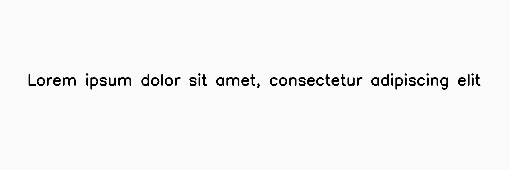
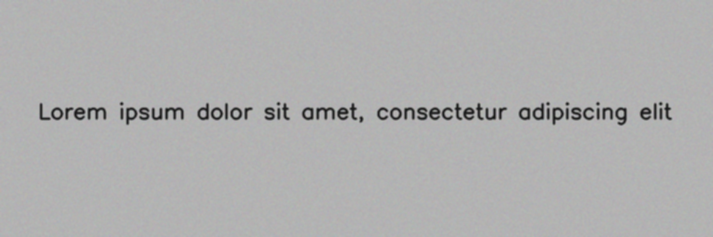

**********
LowLightNoise
**********

.. autoclass:: augraphy.augmentations.lowlightnoise.LowLightNoise
    :members:
    :undoc-members:
    :show-inheritance:

--------
Overview
--------
The LowLightNoise Augmentation simulate low-light conditions in an image by applying various noise effects

Code example:

::

    # import libraries
    import cv2
    import numpy as np
    from augraphy import *

    # create a clean image with single line of text
    image = np.full((500, 1500,3), 250, dtype="uint8")
    cv2.putText(
        image,
        "Lorem ipsum dolor sit amet, consectetur adipiscing elit",
        (80, 250),
        cv2.FONT_HERSHEY_SIMPLEX,
        1.5,
        0,
        3,
    )

    cv2.imshow("Input image", image)

Clean image:

---------
Example 1
---------

In this example, we demonstrate the usage of the LowLightNoise augmentation.
This augmentation is designed to simulate low-light conditions captured by a camera in images by
introducing various noise components.
By default, the number of photons camptured by the camera is typically set between 50 and 100 by default,
determining the lighting conditions in the environment. The alpha,beta and gamma is set between (0.7 ,1.0) ,(10,30)
and (1.0. 1.8) respectively which is used to transform the brightness and contrast of an image.

Code example:

::

    lowlightnoise_obj = LowLightNoise(
        num_photons_range = (50, 100),
        alpha_range = (0.7, 0.9),
        beta_range = (10, 30),
        gamma_range = (1.0 , 1.8)
    )

    lowlightnoise_img = lowlightnoise_obj(image)
    cv2.imshow("LowLightNoise Augmentation", lowlightnoise_img)

Augmented image:

