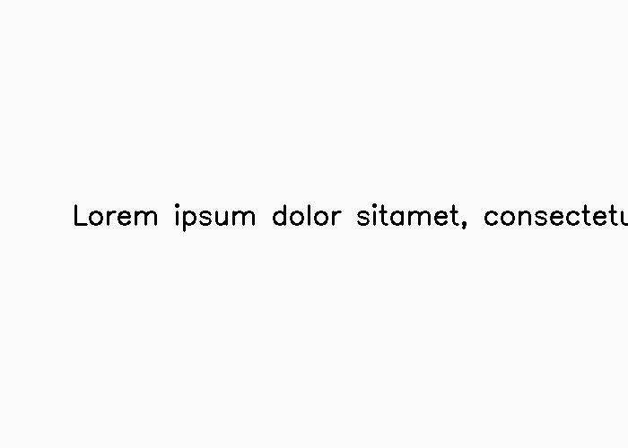
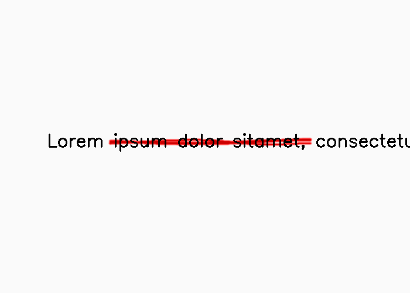
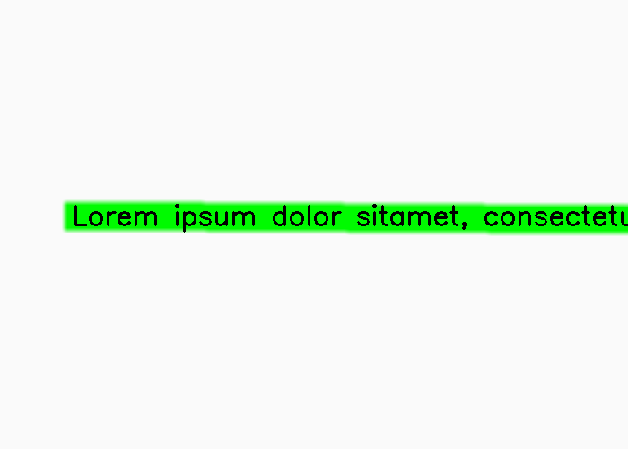

******
Markup
******

.. autoclass:: augraphy.augmentations.markup.Markup
    :members:
    :undoc-members:
    :show-inheritance:
-
Overview
--------
The Markup augmentation uses contours detection to detect text lines and add a smooth text strikethrough, highlight or underline effect.

Initially, a clean image with single line of text is created.

Code example:

::

    # import libraries
    import cv2
    import numpy as np
    from augraphy import *

    # create a clean image with single line of text
    image = np.full((500, 1500,3), 250, dtype="uint8")
    cv2.putText(
        image,
        "Lorem ipsum dolor sit amet, consectetur adipiscing elit",
        (80, 250),
        cv2.FONT_HERSHEY_SIMPLEX,
        1.5,
        0,
        3,
    )

    cv2.imshow("Input image", image)

Clean image:

---------
Example 1
---------
In this example, a Markup augmentation instance is initialized and it is set to apply strikethrough effect ("strikethrough")
Number of strikethrough lines is set to random value in between 5 and 7 (5, 7).
The length is set to moderate ratio (0.5, 1) and the thickness is set in range of 5 to 7 pixels (5, 7).
The color is set to red in BGR channel (0, 0, 255) and number of lines repetition is set to 4.

Code example:

::

    markup_strikethrough = Markup(num_lines_range=(5, 7),
                                  markup_length_range=(0.5, 1),
                                  markup_thickness_range=(1, 2),
                                  markup_type="strikethrough",
                                  markup_color=(0, 0, 255),
                                  repetitions=4,
                                  single_word_mode=True)

    img_markup_strikethrough = markup_strikethrough(image)
    cv2.imshow("markup_strikethrough", img_markup_strikethrough)

Augmented image:

---------
Example 2
---------
In this example, a Markup augmentation instance is initialized and it is set to apply highlight effect ("highlight")
Number of highlighted lines is set to 1 (1,1).
The length is set to moderate ratio (0.5, 1) and the thickness is set in range of 5 to 7 pixels (5, 7).
The color is set to green in BGR channel (0, 255, 0) and number of hightlight repetition is set to 1.

Code example:

::

    markup_highlight = Markup(num_lines_range=(1, 1),
                              markup_length_range=(0.5, 1),
                              markup_thickness_range=(1, 2),
                              markup_type="highlight",
                              markup_color=(0, 255, 0),
                              repetitions=1,
                              single_word_mode=False)

    img_markup_highlight = markup_highlight(image)
    cv2.imshow("markup_highlight", img_markup_highlight)

Augmented image:

---------
Example 3
---------
In this example, a Markup augmentation instance is initialized and it is set to apply underline effect ("underline")
Number of underline lines is set to 1 (1,1).
The length is set to moderate ratio (0.5, 1) and the thickness is set in range of 5 to 7 pixels (5, 7).
The color is set to blue in BGR channel (255, 0, 0) and number of hightlight repetition is set to 1.

Code example:

::

    markup_underline = Markup(num_lines_range=(1, 1),
                              markup_length_range=(0.5, 1),
                              markup_thickness_range=(1, 2),
                              markup_type="underline",
                              markup_color=(255, 0, 0),
                              repetitions=1,
                              single_word_mode=False)

    img_markup_underline = markup_underline(image)
    cv2.imshow("markup_underline", img_markup_underline)

Augmented image:

.. figure:: augmentations/markup/markup_underline.png
