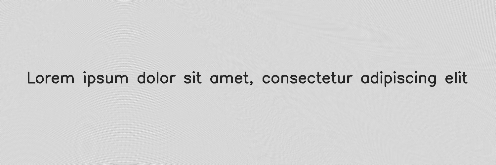

*****
Moire
*****

.. autoclass:: augraphy.augmentations.moire.Moire
    :members:
    :undoc-members:
    :show-inheritance:

--------
Overview
--------
The Moire augmentation creates a moire pattern effect in the image by blending the moire pattern using OverlayBuilder.

Initially, a clean image with single line of text is created.

Code example:

::

    # import libraries
    import cv2
    import numpy as np
    from augraphy import *

    # create a clean image with single line of text
    image = np.full((500, 1500,3), 250, dtype="uint8")
    cv2.putText(
        image,
        "Lorem ipsum dolor sit amet, consectetur adipiscing elit",
        (80, 250),
        cv2.FONT_HERSHEY_SIMPLEX,
        1.5,
        0,
        3,
    )

    cv2.imshow("Input image", image)

Clean image:

.. figure:: augmentations/input.png

---------
Example 1
---------
In this example, a Moire augmentation instance is initialized and the density of moire pattern is set to random value in between 15 and 20 (15,20).
The method to blend moire pattern is set to "normal" method and the blending alpha is set to low value (0.1).

Code example:

::

    moire = Moire(moire_density = (15,20),
                  moire_blend_method = "normal",
                  moire_blend_alpha = 0.1,
                 )

    img_moire = moire(image)
    cv2.imshow("moire", img_moire)

Augmented image:

