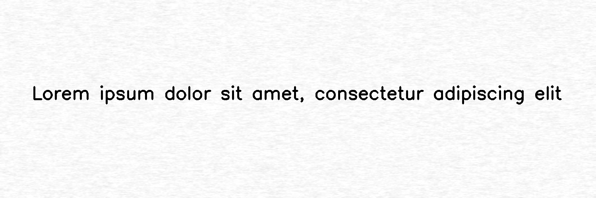

**************
NoiseTexturize
**************

.. autoclass:: augraphy.augmentations.noisetexturize.NoiseTexturize
    :members:
    :undoc-members:
    :show-inheritance:

--------
Overview
--------
The Noise Texturize augmentation creates a random noise pattern to emulate paper textures.

Initially, a clean image with single line of text is created.

Code example:

::

    # import libraries
    import cv2
    import numpy as np
    from augraphy import *

    # create a clean image with single line of text
    image = np.full((500, 1500,3), 250, dtype="uint8")
    cv2.putText(
        image,
        "Lorem ipsum dolor sit amet, consectetur adipiscing elit",
        (80, 250),
        cv2.FONT_HERSHEY_SIMPLEX,
        1.5,
        0,
        3,
    )

    cv2.imshow("Input image", image)

Clean image:

.. figure:: augmentations/input.png

---------
Example 1
---------
In this example, a NoiseTexturize augmentation instance is initialized and the sigma value that define noise fluctuatiosn is set to random value in between 2 and 3 (2, 3).
The noise turbulence range is set to random value in between 2 and 5 (2,5).
The texture width and height are set to random value in netween 50 to 500 pixels (50, 500).

Code example:

::

    noise_texturize = NoiseTexturize(sigma_range=(2, 3),
                                     turbulence_range=(2, 5),
				     texture_width_range=(50, 500),
                                     texture_height_range=(50, 500),
                                     )

    img_noise_texturize = noise_texturize(image)
    cv2.imshow("noise_texturize", img_noise_texturize

Augmented image:

