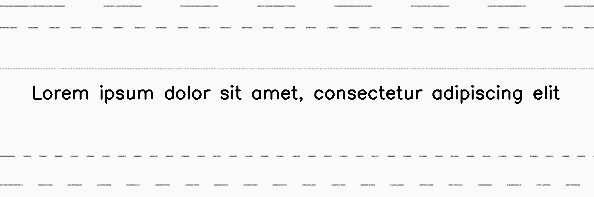

**********
NoisyLines
**********

.. autoclass:: augraphy.augmentations.noisylines.NoisyLines
    :members:
    :undoc-members:
    :show-inheritance:

--------
Overview
--------
The NoisyLines augmentation create noisy lines by drawing horizontal or vertical lines in a fixed intervals.

Initially, a clean image with single line of text is created.

Code example:

::

    # import libraries
    import cv2
    import numpy as np
    from augraphy import *

    # create a clean image with single line of text
    image = np.full((500, 1500,3), 250, dtype="uint8")
    cv2.putText(
        image,
        "Lorem ipsum dolor sit amet, consectetur adipiscing elit",
        (80, 250),
        cv2.FONT_HERSHEY_SIMPLEX,
        1.5,
        0,
        3,
    )

    cv2.imshow("Input image", image)

Clean image:

.. figure:: augmentations/input.png

---------
Example 1
---------
In this example, a NoisyLines augmentation instance is initialized and the lines direction is set to horizontal (0).
The number of noisy lines is set to random value in between 3 and 5 (3,5).
The lines color is set to black (0,0,0) and the thickness of the lines is set to 2 (2,2).
The random noise intensity is set randomly in between 1 to 10 percent (0.01, 0.1).
The space interval in each line is set randomly in between 0 and 100 (0,100).
The Gaussian kernel value in blurring the lines is set to 3 (3,3).
The method to overlay lines into the image is set to the default method ("ink_to_paper").

Code example:

::

    noisylines = NoisyLines(noisy_lines_direction = 0,
                            noisy_lines_number_range = (3,5),
                            noisy_lines_color = (0,0,0),
                            noisy_lines_thickness_range = (2,2),
                            noisy_lines_random_noise_intensity_range = (0.01, 0.1),
                            noisy_lines_length_interval_range = (0,100),
                            noisy_lines_gaussian_kernel_value_range = (3,3),
                            noisy_lines_overlay_method = "ink_to_paper",
			    )

    img_noisylines = noisylines(image)
    cv2.imshow("noisylines", img_noisylines)

Augmented image:

