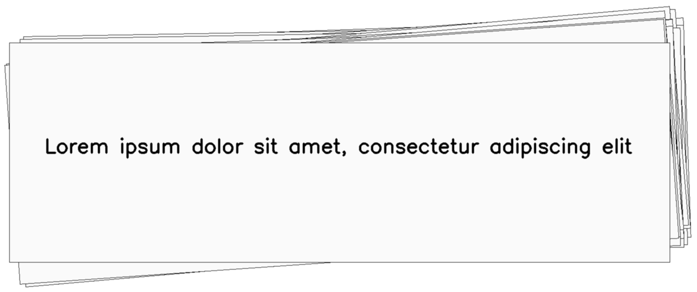

**********
PageBorder
**********

.. autoclass:: augraphy.augmentations.pageborder.PageBorder
    :members:
    :undoc-members:
    :show-inheritance:

--------
Overview
--------
The Page Border augmentation applies a shadow of underlying pages on any side of the page, creating an effect of single or multiple borders on specified side of the page.

Initially, a clean image with single line of text is created.

Code example:

::

    # import libraries
    import cv2
    import numpy as np
    from augraphy import *

    # create a clean image with single line of text
    image = np.full((500, 1500,3), 250, dtype="uint8")
    cv2.putText(
        image,
        "Lorem ipsum dolor sit amet, consectetur adipiscing elit",
        (80, 250),
        cv2.FONT_HERSHEY_SIMPLEX,
        1.5,
        0,
        3,
    )

    cv2.imshow("Input image", image)

Clean image:

.. figure:: augmentations/input.png

---------
Example 1
---------
In this example, a PageBorder augmentation instance is initialized and the page borders effect is added to random side of the image ("random").
Number of pages is set to 4 (4) and the border background value is set to bright value (230,255).
Border width is in between 40 to 80 pixels (40, 80) and the noise intensity is set at moderate value (0.4,0.5).
The curvy frequency of page border is set in between 4 and 8 (4, 8) and each with height 2 to 4 picels (2,4).
The border value is set in between 30 to 120 (30, 120).

Code example:

::

    page_border = PageBorder(side="random",
                             border_background_value = (230,255),
                             flip_border = 0,
                             width_range=(40, 80),
                             pages=4,
                             noise_intensity_range=(0.4, 0.5),
                             curve_frequency = (4, 8),
                             curve_height = (2, 4),
                             curve_length_one_side = (50, 100),
                             value=(30, 120),
                             same_page_border=0,
                                )
    img_page_border = page_border(image)
    cv2.imshow("page_border", img_page_border)

Augmented image:

