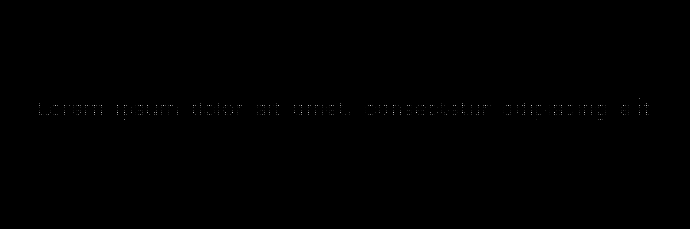
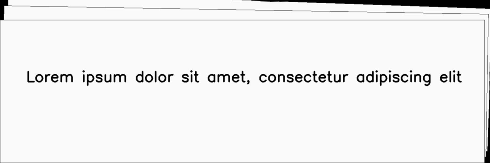
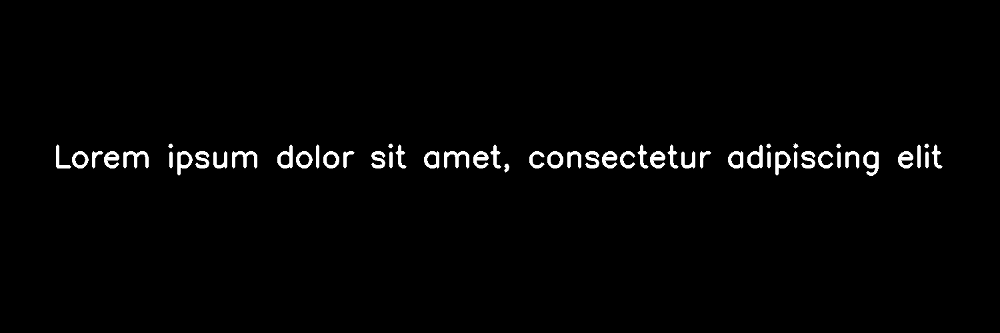
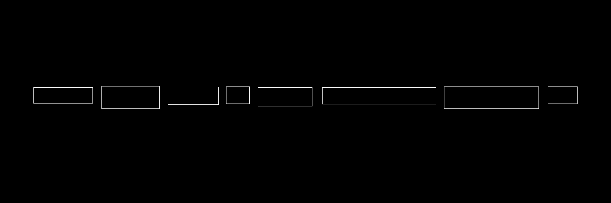

**********
PageBorder
**********

.. autoclass:: augraphy.augmentations.pageborder.PageBorder
    :members:
    :undoc-members:
    :show-inheritance:

--------
Overview
--------
The Page Border augmentation stacking multiple images, creating an effect of single or multiple page borders on any side of the page. For additional input such as mask and keypoints, they are fully supported. For bounding boxes, their box size might be pruned if part of their box is within the border area.

Initially, a clean image with single line of text is created.

Code example:

::

    # import libraries
    import cv2
    import numpy as np
    from augraphy import *

    # create a clean image with single line of text
    image = np.full((500, 1500,3), 250, dtype="uint8")
    cv2.putText(
        image,
        "Lorem ipsum dolor sit amet, consectetur adipiscing elit",
        (80, 250),
        cv2.FONT_HERSHEY_SIMPLEX,
        1.5,
        0,
        3,
    )

    cv2.imshow("Input image", image)

Clean image:

.. figure:: augmentations/input.png

---------
Example 1
---------
In this example, a PageBorder augmentation instance is initialized and the page borders effect width and height is set to 30 (right) and -40 (top) pixels (30,-40).
The page border color is set to black (0,0,0) and the background color is set to white (255,255,255).
No trimming is done to any side of the added page border effect (0, 0, 0, 0).
The border effect is set to not using any cache images (page_border_use_cache_images=0) and the number of pages is set to 10 (10).
The rotation angle will be randomized (page_rotate_angle_in_order=0) and the rotation range is between 1 to 5 degree (1,5).
The curvy frequency in the borders is set to random value between 0 and 1 (0,1), each with height of 1 to 2 pixels (1,2).
The curvy one side length is set to random value in between 30 to 60 (30, 60).
The page border effect is extended beyond the input page size (same_page_border=0) so some padding will be applied.

Code example:

::

    page_border = PageBorder(page_border_width_height = (30, -40),
                             page_border_color=(0, 0, 0),
			     page_border_background_color=(255, 255, 255),
                             page_border_use_cache_images = 0,
                             page_border_trim_sides = (0, 0, 0, 0),
                             page_numbers = 10,
                             page_rotate_angle_in_order = 0,
                             page_rotation_angle_range = (1, 5),
                             curve_frequency=(0, 1),
                             curve_height=(1, 2),
                             curve_length_one_side=(30, 60),
                             same_page_border=0,
                             )
    img_page_border = page_border(image)
    cv2.imshow("page_border", img_page_border)

Augmented image:

.. figure:: augmentations/pageborder/page_border.png

---------
Example 2
---------
In this example, a PageBorder augmentation will be applied to additional inputs such as mask, keypoints and bounding boxes.
The PageBorder augmentation will be using the default parameters value and hence no additional parameters value will be specified.

Code example:

::

    page_border = PageBorder()

    img_page_border, mask, keypoints, bounding_boxes = page_border(image=image, mask=mask, keypoints=keypoints, bounding_boxes=bounding_boxes)

    cv2.imshow("page_border", img_page_border)

Input mask:

.. figure:: augmentations/input_mask.png

Input keypoints:

Input bounding boxes:

.. figure:: augmentations/input_bounding_boxes.png

Augmented image:

Augmented mask:

Augmented keypoints:

.. figure:: augmentations/pageborder/page_border2_keypoints.png

Augmented bounding boxes:

