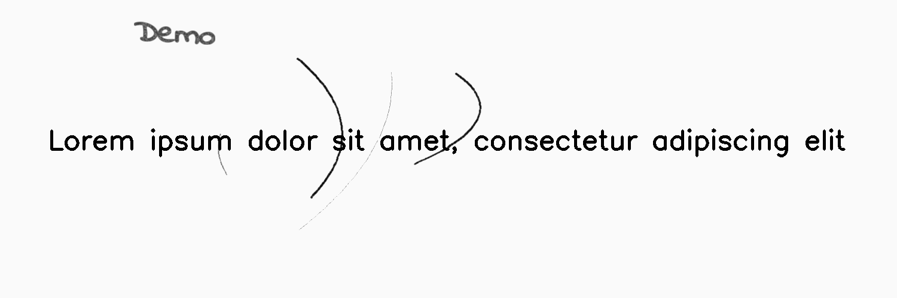

***************
PencilScribbles
***************

.. autoclass:: augraphy.augmentations.pencilscribbles.PencilScribbles
    :members:
    :undoc-members:
    :show-inheritance:

--------
Overview
--------
The Pencil Scribbles augmentation applies random pencil scribbles to image.

Initially, a clean image with single line of text is created.

Code example:

::

    # import libraries
    import cv2
    import numpy as np
    from augraphy import *
    
    
    # create a clean image with single line of text
    image = np.full((500, 1500,3), 250, dtype="uint8")
    cv2.putText(
        image,
        "Lorem ipsum dolor sit amet, consectetur adipiscing elit",
        (80, 250),
        cv2.FONT_HERSHEY_SIMPLEX,
        1.5,
        0,
        3,
    )
    
    cv2.imshow("Input image", image)

Clean image:

.. figure:: augmentations/input.png

---------
Example 1
---------
In this example, a PencilScribbles augmentation instance is initialized and size of scribble effect is set to 400 x 800 (400, 800).
Number of scribbles is set in between 2 to 3 (2,3) and number of stroke count per scribble is set to 1 (1,1).
Thickenss of scribbles is set to random value in between 1 and 3 (1,3) and the beightness change of scribble is set to 128. 

Code example:

::

    pencil_scribbles = PencilScribbles(size_range=(400, 800),
                                       count_range=(2, 3),
                                       stroke_count_range=(1, 1),
                                       thickness_range=(1, 3),
                                       brightness_change=128
                                       )
    
    img_pencil_scribbles = pencil_scribbles(image)
    cv2.imshow("pencil_scribbles", img_pencil_scribbles)

Augmented image:

