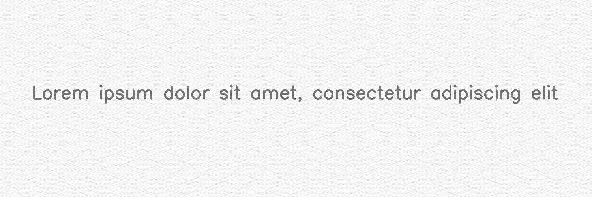

**********
PatternGenerator
**********

.. autoclass:: augraphy.augmentations.quasi_crystal.PatternGenerator
    :members:
    :undoc-members:
    :show-inheritance:

--------
Overview
--------
The PatternGenerator creates aperiodic crystals. We take a geometric plane and each
point on the geometric plane is transformed to a cosine function with phase and amplitude.

Code example:

::

    # import libraries
    import cv2
    import numpy as np
    from augraphy import *

    # create a clean image with single line of text
    image = np.full((500, 1500,3), 250, dtype="uint8")
    cv2.putText(
        image,
        "Lorem ipsum dolor sit amet, consectetur adipiscing elit",
        (80, 250),
        cv2.FONT_HERSHEY_SIMPLEX,
        1.5,
        0,
        3,
    )

    cv2.imshow("Input image", image)

Clean image:

.. figure:: augmentations/input.png

---------
Example 1
---------
In this example, a PatternGenerator instance with number of rotation is set between 10 and 15.
The background image size is set of width = 512 and height = 512.

Code example:

::

    quasi_pattern = PatternGenerator(
        imgx = 512,
        imgy= 512,
        n_rotation = (10,15)
    )

    img_final = quasi_pattern(image)
    cv2.imshow("Image", img_final)

Augmented image:

