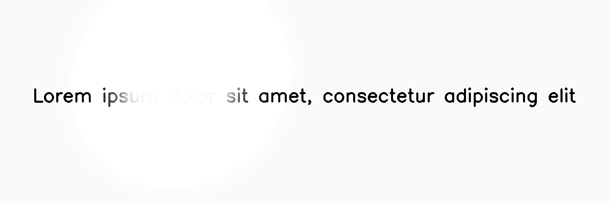

**************
ReflectedLight
**************

.. autoclass:: augraphy.augmentations.reflectedlight.ReflectedLight
    :members:
    :undoc-members:
    :show-inheritance:

--------
Overview
--------
The ReflectedLight augmentation creates a reflected light effect by drawing ellipses of different brightness.

Initially, a clean image with single line of text is created.

Code example:

::

    # import libraries
    import cv2
    import numpy as np
    from augraphy import *

    # create a clean image with single line of text
    image = np.full((500, 1500,3), 250, dtype="uint8")
    cv2.putText(
        image,
        "Lorem ipsum dolor sit amet, consectetur adipiscing elit",
        (80, 250),
        cv2.FONT_HERSHEY_SIMPLEX,
        1.5,
        0,
        3,
    )

    cv2.imshow("Input image", image)

Clean image:

.. figure:: augmentations/input.png

---------
Example 1
---------
In this example, a ReflectedLight augmentation instance is initialized. The smoothness of the effect is set at 0.8 (0.8).
The internal radius of ellipse is set to any value in between 0% to 20% of the image minimum size (0.0, 0.2).
The external radius of ellipse is set to any value in between 10% to 80% of the image minimum size (0.1, 0.8).
The ratio of minor to major axes of ellipse is set to any value in between 10% to 80%. (0.1, 0.8).
The reflect light color is set to white color (255,255,255).
The internal ellipse max brightness is set to any value in between 90% to 100% brightness (0.9, 1.0).
The external ellipse max brightness is set to 90% brightness (0.9, 0.9).
The reflected light location is set to random location ("random").
The ellipse of reflected light effect is set to random angle (0, 360).
The Gaussian kernel in blurring the effect is set to any value in between 5 to 310 (5, 310).

Code example:

::

    reflected_light = NoiseTexturize(reflected_light_smoothness = 0.8,
                                     reflected_light_internal_radius_range=(0.0, 0.2),
                                     reflected_light_external_radius_range=(0.1, 0.8),
                                     reflected_light_minor_major_ratio_range = (0.9, 1.0),
                                     reflected_light_color = (255,255,255),
                                     reflected_light_internal_max_brightness_range=(0.9,1.0),
                                     reflected_light_external_max_brightness_range=(0.9,0.9),
                                     reflected_light_location = "random",
                                     reflected_light_ellipse_angle_range = (0, 360),
                                     reflected_light_gaussian_kernel_size_range = (5,310),
                                     )

    img_reflected_light = reflected_light(image)
    cv2.imshow("reflected_light", img_reflected_light

Augmented image:

