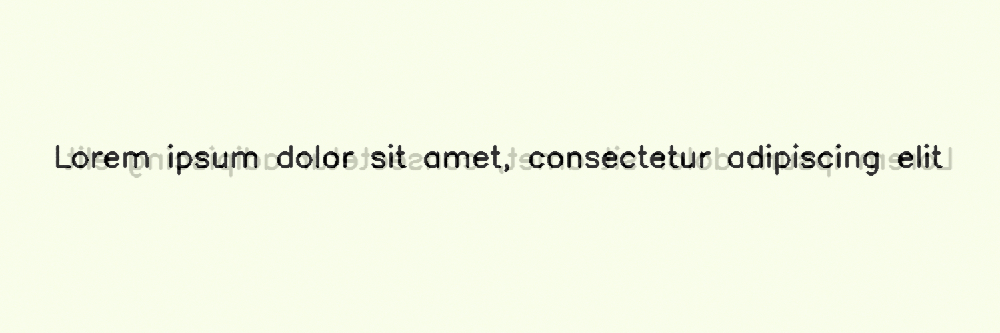
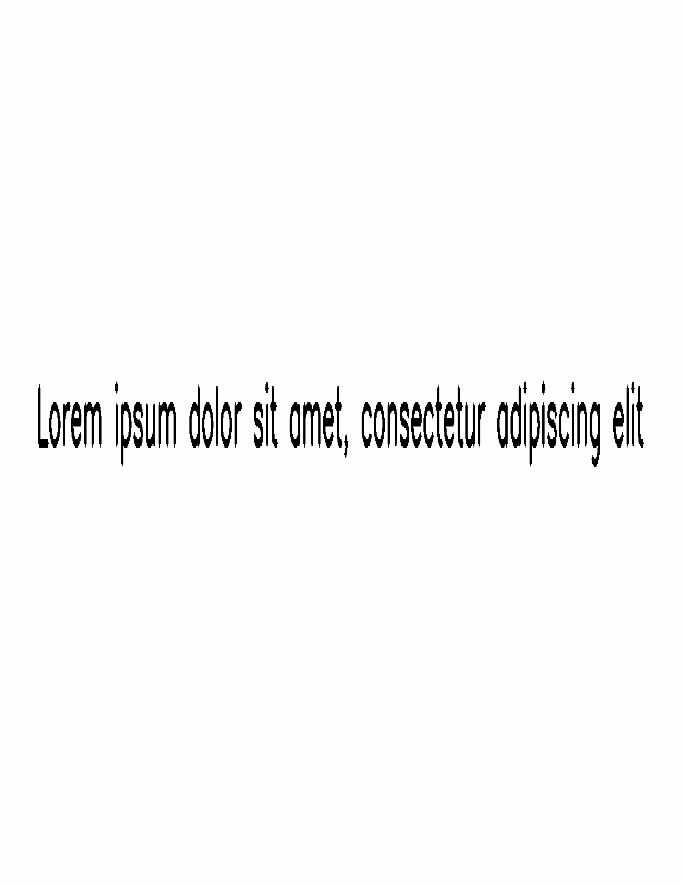
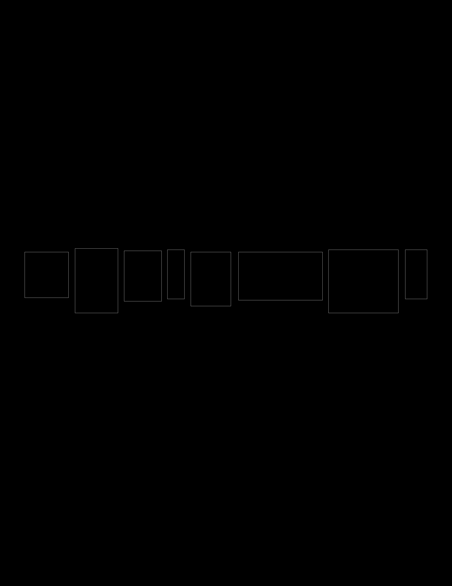

*******
Rescale
*******

.. autoclass:: augraphy.augmentations.rescale.Rescale
    :members:
    :undoc-members:
    :show-inheritance:

--------
Overview
--------
The Rescale augmentation rescales image to the desired DPI. Usually Rescale will be used in the pre-phase of an augmentation pipeline along with the argument "fixed_dpi". By enabling "fixed_dpi", input image will be rescaled to desired DPI for augmentation purpose, and then augmented image will be rescaled back to the input DPI at the end of the process. For additional input such as mask and keypoints, they are fully supported. For bounding boxes, only the start point and end point will be affected.

Initially, a clean image with single line of text is created.

Code example:

::

    # import libraries
    import cv2
    import numpy as np
    from augraphy import *

    # create a clean image with single line of text
    image = np.full((500, 1500,3), 250, dtype="uint8")
    cv2.putText(
        image,
        "Lorem ipsum dolor sit amet, consectetur adipiscing elit",
        (80, 250),
        cv2.FONT_HERSHEY_SIMPLEX,
        1.5,
        0,
        3,
    )

    cv2.imshow("Input image", image)

Clean image:

.. figure:: augmentations/input.png

---------
Example 1
---------
In this example, a Rescale augmentation instance is initialized and the target DPI is set to 300. The Rescale augmentation will be used in the pre-phase of an augmentation pipeline in order to scale up the image for augmentation purpose. 2 pipelines will be used, one with fixed DPI and another one without fixed DPI.

Code example:

::

    rescale = Rescale(target_dpi=300)
	
    pipeline1 = AugraphyPipeline(pre_phase=[rescale], ink_phase=[InkBleed()], paper_phase=[ColorPaper()], post_phase=[BleedThrough()], fixed_dpi=1)
    pipeline2 = AugraphyPipeline(pre_phase=[rescale], ink_phase=[InkBleed()], paper_phase=[ColorPaper()], post_phase=[BleedThrough()], fixed_dpi=0)

    img_rescale1 = pipeline1(image)
    img_rescale1 = pipeline2(image)

    cv2.imshow("rescale - fixed dpi", img_rescale1)
    cv2.imshow("rescale - non fixed dpi", img_rescale2)

Augmented image (fixed dpi):

Augmented image (non fixed dpi):

.. figure:: augmentations/rescale/rescale_non_fixed_dpi.png

---------
Example 2
---------
In this example, a Rescale augmentation will be used with additional inputs such as mask, keypoints and bounding boxes.
The target DPI of the Rescale augmentation will be set to 300.

Code example:

::

    rescale = Rescale(target_dpi=300)

    img_rescale, mask, keypoints, bounding_boxes = rescale(image=image, mask=mask, keypoints=keypoints, bounding_boxes=bounding_boxes)

    cv2.imshow("rescale", img_rescale)

Input mask:

.. figure:: augmentations/input_mask.png

Input keypoints:

.. figure:: augmentations/input_keypoints.png

Input bounding boxes:

.. figure:: augmentations/input_bounding_boxes.png

Augmented image:

Augmented mask:

Augmented keypoints:

Augmented bounding boxes:

